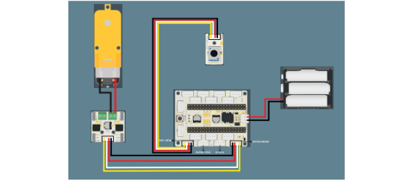
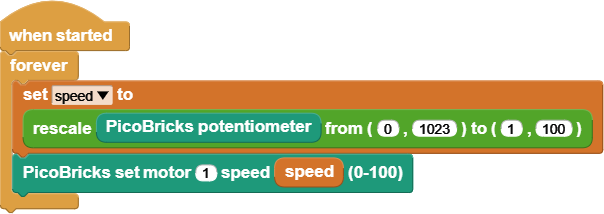

###########
Ferris Wheel
###########

Introduction
-------------
A Ferris wheel is an amusement vehicle in which seating is positioned around a circle that spins around the axis of a revolving wheel. 

.. image:: /../_static/ferris-wheel.gif

PicoBricks - Ferris Wheel is a project kit that you can adjust the speed of the Ferris Wheel according to the value ıof the potentiometer by using the potentiometer, motor driver and Raspberry Pi Pico module on PicoBricks, after putting together the wooden pieces from the set content.

Modules on The Ferris Wheel
-------------------------------

- Potentiometer: It is an input sensor that we can change the resistance value applied to the circuit with a physical intervention.

- Motor Driver: It is a circuit element that adjusts the speed and frequency of the circuit elements.

- DC Motor: It provides rotational motion in mechanical projects that require rotational movement

Wiring Diagram
--------------

    

MicroPython Code of the Project
--------------------------------
.. code-block::

#Ferris Wheel
# You need 3 batteries for this project.

import time
from machine import PWM, Pin, ADC

pot = ADC(26)
motor_1 = PWM(Pin(21))
motor_1.duty_u16(0)

while True:
    pot_val = pot.read_u16()
    print(pot_val)
    time.sleep(0.5)
    
    if pot_val > 150:
        motor_1.duty_u16(pot_val)
    else:
        motor_1.duty_u16(0)

.. tip::
  If you rename your code file to main.py, your code will run after every boot.
   
Arduino C Code of the Project
-------------------------------

.. code-block::

/*Ferris Wheel*/
#define pot 26
#define motor 21

void setup() {
  Serial.begin(115200);
  pinMode(motor, OUTPUT);
  pinMode(pot, INPUT);
}

void loop() {
  int pot_value = analogRead(pot);

  if (pot_value > 150) {
    analogWrite(motor, pot_value);
  }
  else {
    analogWrite(motor, LOW);
  }
Serial.println(pot_value);
}

Coding the Project with MicroBlocks
------------------------------------
+---------------------+
||ferris-wheel-mb.png||     
+---------------------+

.. note::
  To code with MicroBlocks, simply drag and drop the image above to the MicroBlocks Run tab.
  

    

