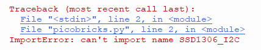
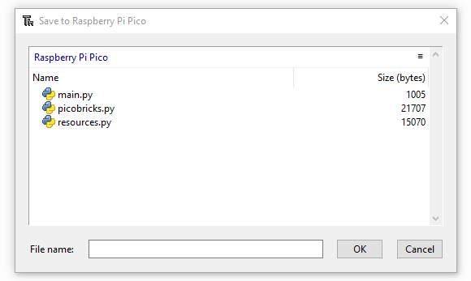

Errors
===========================
PicoBricks ile proje geliştirirken bazı basit hatalarla karşılaşabilirsiniz. Bu hataları kendiniz çözerken, PicoBricks'in çalışma mantığını daha iyi kavrayabilirsiniz. Aşağıda, bu basit hataları ve çözümlerini bulabilirsiniz. Daha kompleks hatalar için ``support@robotistan.com`` adresinden bizimle iletişime geçebilirsiniz.

Library Error
--------------------------------
Raspberry Pi Pico'nun içinde PicoBricks için gerekli kütüphanelerin olmazsa, aşağıdaki hata ile karşılaşırsınız. Bu hatanın çözümü için kütüphane kurulum adımlarını takip edebilirsiniz. 

    
Kütüphane Kurulum adımları
-------------------------------
- Kütüphaneler için GitHub'taki gerekli sayfaya gidin.
- Gerekli kütüphanelerin kodunu kopyalayın.
- MicroPython kodlama sayfasına gidip, kodları yapıştırın.
- Ctrl + Shift + s tuşlarına basın ve Raspberry Pi Pico sekmesine tıklayın.
- Kütüphaneleri GitHub'taki isimleri ile kaydedin ve ``OK`` tuşuna basın.
- Kütüphaneler eklendiği zaman, aşağıdaki gibi görünecekler.

    
    
OLED Error
---------------
OLED modülü ile ilgili bazı hatalar ile karşılaşabilirsiniz. Bu hatalar bağlantı veya kütüphanelerle ilgili olabilir. Hadi, bu hatalara birlikte göz atalım. 

OLED Error with MicroBlocks
----------------------------
OLED kütüphanesini içeren kodları direkt olarak GitHub'tan aldığınız zaman, bazen kütüphaneler eklenmeyebilir. Kütüphaneler yokken direkt olarak kodu çalıştırırsanız aşağıdaki gibi hata alabilirsiniz. 

DHT11 Error
-------------------
    
    

 
 

