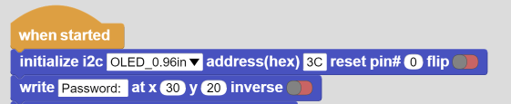

Errors
===========================
You may encounter some simple errors while developing projects with PicoBricks. As you solve these errors yourself, you can better understand the working logic of PicoBricks. Below, you can find these simple errors and their solutions. For more complex errors, you can contact us at ``support@robotistan.com``.

Library Error
--------------------------------
If the necessary libraries for PicoBricks are not included in the Raspberry Pi Pico, you will encounter the following error. You can follow the library installation steps to solve this error.

.. figure:: ../_static/error.png      
    :align: center
    :width: 620
    :figclass: align-center
    
Library Installation Steps
-------------------------------
- Go to the required `page <https://github.com/Robotistan/PicoBricks/tree/main/Software/Pre-Installed%20Code>`_ on GitHub for libraries.  
- Copy the code of the required libraries.
- Go to MicroPython coding page and paste the codes.
- Press Ctrl + Shift + s and click on Raspberry Pi Pico tab.
- Save the libraries with their names on GitHub and press ``OK``.
- When the libraries are added, they will look like below.

.. figure:: ../_static/addlibrary.png      
    :align: center
    :width: 620
    :figclass: align-center
    
    
OLED Error
---------------
You may encounter some errors related to the OLED module. These errors may be related to connection or libraries. Let's take a look at these errors together.

OLED Error with MicroBlocks
----------------------------
1- When you get the code containing the OLED library directly from GitHub, sometimes the libraries may not be included. If you run the code directly when there are no libraries, you may get an error. If you get an error message due to libraries, you should add the necessary libraries from the libraries tab.

2- Errors related to OLED code may be received in MicroBlocks. For example, you need to initialize the display before using the code of the OLED library. Otherwise, you will encounter the error as below.

- To solve the error, you should add ``initialize`` code.

OLED Error with PicoBricks
------------------------------------

DHT11 Error
-------------------
    
    

 
 

