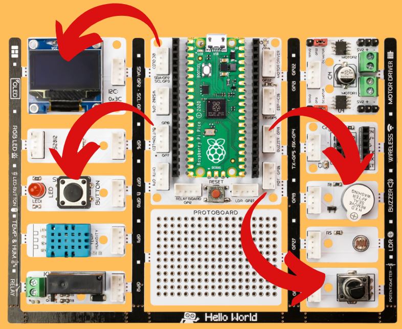

###########
Dominate The Rhythm
###########

Introduction
-------------
When the user presses the button to start the song, we will prepare the note codes that will allow the notes to play for the duration calculated according to the rthm variable.   

Project Details and Algorithm
------------------------------

Many events in our lives have been digitized. One of them is sounds. The tone and intensity of the sound can be processed electrically. So we can extract notes electronically. The smallest unit of sounds that make up music is called a note. Each note has a frequency and intensity. With the codes we will write, we can adjust which note should be played and how long it should last by applying frequency and intensity. In this project, we will prepare a music system that will play the melody of a song using the buzzer module and adjust the rhythm with the ``potentiometer module`` with Picobricks. You will also learn the use of variables, which has an important place in programming terminology, in this project. With Picobricks you can play any song whose sheet we know. We will use the button-LED module to start the song, the potentiometer module to adjust the speed of the song, and the buzzer module to play the notes. Potentiometer is analog input module. It is variable resistance. As the amount of current flowing through it is turned, it increases and decreases like opening and closing a faucet. We will adjust the speed of the song by controlling this amount of current with codes. Buzzers change the sound levels according to the intensity of the current passing over them, and the sound tones according to the voltage frequency. With Microblock's, we can easily code the notes we want from the buzzer module by adjusting their tones and durations. We will check the button press status in the project. We will make the melody start playing when the button is pressed. During the playing of the melody, we will use a variable called rthm to increase or decrease the playing times of the notes at the same rate. After Picobricks starts, we will enable the user to adjust the rthm variable with the potentiometer, either while playing the melody or before playing it. As long as Picobricks is on, we will divide the potentiometer value ``(0-1023) by 128`` and assign it to the rthm variable. Variables are data structures that we use when we want to use values that can be changed by the user or sensors in our codes. 

Wiring Diagram
--------------

.. figure:: ../_static/dominate-rhythm.png      
    :align: center
    :width: 500
    :figclass: align-center
    

You can program and run Picobricks modules without any wiring. If you are going to use the modules by separating them from the board, then you should make the module connections with the Grove cables provided.

MicroPython Code of the Project
--------------------------------
.. code-block::

   from machine import Pin,PWM,ADC,I2C #to acces the hardware picobricks
   from utime import sleep #time library
   from picobricks import SSD1306_I2C
   import utime

   WIDTH=128
   HEIGHT=64
   #define the weight and height picobricks

   sda=machine.Pin(4)
   scl=machine.Pin(5)
   #we define sda and scl pins for inter-path communication
   i2c=machine.I2C(0, sda=sda, scl=scl, freq=2000000)#determine the frequency values
   oled=SSD1306_I2C(WIDTH, HEIGHT, i2c)

   button= Pin(10,Pin.IN,Pin.PULL_DOWN)
   pot=ADC(Pin(26))
   buzzer= PWM(Pin(20))
   #determine our input and output pins
   pressed = False
   rithm = 0

   tones = {
   "A3": 220,
   "D4": 294,
   "E4": 330,
   "F4": 349
      }
   #define the tones

   mysong = ["A3","E4","E4","E4","E4","E4","E4","F4","E4","D4","F4","E4"]#let's define the tones required for our song in the correct order into a sequence
   noteTime = [1,0.5,0.5,0.5,0.5,0.5,0.5,0.5,0.5,0.5,0.5,1]#define wait times between tones into an array

        
   def playtone(frequency):
    buzzer.duty_u16(6000)
    buzzer.freq(frequency)
   #define the frequencies of the buzzer
   def playsong(pin):
    global pressed
    pressed = True
   #play the tones with the right cooldowns
   #An finally we need to tell the pins when to trigger, and the function to call when they detect an event:       
   button.irq(trigger=Pin.IRQ_RISING, handler=playsong)
   note_count = 9999
   played_time = 0
   while True:
    current_time = utime.ticks_ms()
    oled.show()
    oled.text("Press the button",0,0)
    
    if (note_count < len(mysong)):
        oled.fill(0)
        oled.text("Dominate ",30,10)
        oled.text("the ",45,25)
        oled.text("Rhythm ",35,40)
        rithm=((pot.read_u16()/65535.0)*20) +1
        if (current_time - played_time)/1000.0 >= noteTime[note_count]/rithm:
            played_time = utime.ticks_ms()
            playtone(tones[mysong[note_count]])
            note_count += 1
    else:
        buzzer.duty_u16(0)
        
    if pressed:
        
        note_count = 0
        pressed = False
        
        
        

.. tip::
  If you rename your code file to main.py, your code will run after every boot.
   
Arduino C Code of the Project
-------------------------------

.. code-block::

   #include <Wire.h>
   #include "ACROBOTIC_SSD1306.h"

   int buzzer = 20;
   int pot =26;
   int button= 10;
   //define the buzzer, pot and button 

   int Re = 294;
   int Mi = 330;
   int Fa = 349;
   int La = 440;
   //DEFİNE THE TONES
   void setup()
      {
   Wire.begin();  
   oled.init();                      
   oled.clearDisplay();              

   pinMode(buzzer,OUTPUT);
   pinMode(26,INPUT);
   pinMode(button,INPUT);
   //determine our input and output pins
      }

   void loop()
      {
   int rithm = (analogRead(pot))/146;
   String char_rithm = String(rithm);
   oled.setTextXY(3,4);              
   oled.putString("Speed: ");
   oled.setTextXY(3,10);              
   oled.putString(char_rithm);
  
   //print "Speed: "  and speed value on the OLED at x=3 y=4

   delay(10); 

   if (digitalRead(button) == 1){

    oled.clearDisplay(); 
    oled.setTextXY(3,2);              
    oled.putString("Now playing...");
    //print "Speed: "  and speed value on the OLED at x=3 y=4
    tone(buzzer, La); delay (1000/(rithm+1));
    tone(buzzer, Mi); delay (500/(rithm+1));
    tone(buzzer, Mi); delay (500/(rithm+1));
    tone(buzzer, Mi); delay (500/(rithm+1));
    tone(buzzer, Mi); delay (500/(rithm+1));
    tone(buzzer, Mi); delay (500/(rithm+1));
    tone(buzzer, Mi); delay (500/(rithm+1));
    tone(buzzer, Fa); delay (500/(rithm+1));
    tone(buzzer, Mi); delay (500/(rithm+1));
    tone(buzzer, Re); delay (500/(rithm+1));
    tone(buzzer, Fa); delay (500/(rithm+1));
    tone(buzzer, Mi); delay (1000/(rithm+1));
    
    //play the notes in the correct order and time when the button is pressed

    oled.clearDisplay();
    //clear the screen
      }
    noTone(buzzer);
    //stop the buzzer
   }

Coding the Project with MicroBlocks
------------------------------------
+------------------+
||dominate-rhythm2||     
+------------------+

.. |dominate-rhythm2| image:: _static/dominate-rhythm2.png

.. note::
  To code with MicroBlocks, simply drag and drop the image above to the MicroBlocks Run tab.
  

    
