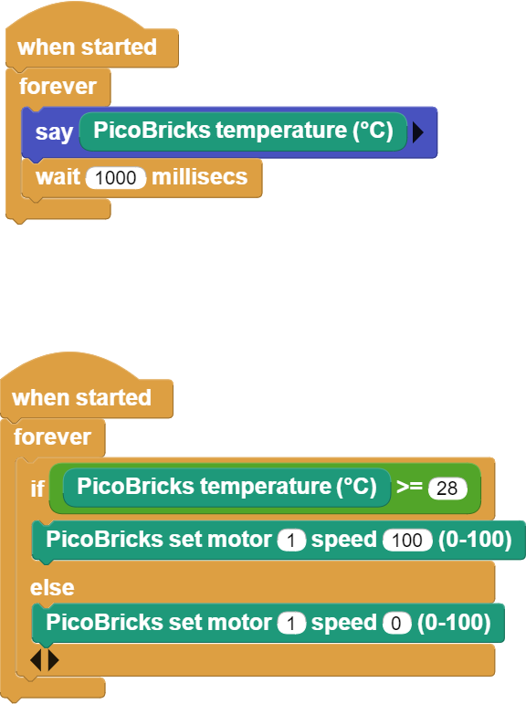

###########
Smart Cooler
###########

Introduction
-------------
In our project, we will firstly display the temperature values measured by the DHT11 temperature and humidity sensor on Picobricks. Then, we will define a temperature limit and write the necessary codes for the DC motor connected to Picobricks to start rotating when the temperature value from the DHT11 module reaches this limit, and for the DC motor to stop when the temperature value falls below the limit we have determined.

Project Details and Algorithm
------------------------------

Air conditioners are used to cool in the summer and warm up in the winter. Air conditioners adjust the degree of heating and cooling according to the temperature of the environment. While cooking the food, the ovens try to rise to the temperature value set by the user and maintain that temperature. These two electronic devices use special temperature sensors to control the temperature. In addition, temperature and humidity are measured together in greenhouses. In order to keep these two values in balance at the desired level, it is tried to provide air flow with the fan. In Picobricks, you can measure temperature and humidity separately and interact with the environment with these measurements. In this project, we will prepare a cooling system that automatically adjusts the fan speed according to the temperature with Picobricks. In this way, you will learn the DC motor operating system and motor speed adjustment.

Wiring Diagram
--------------

.. figure:: ../_static/smart-cooler.png      
    :align: center
    :width: 500
    :figclass: align-center
    

You can program and run Picobricks modules without any wiring. If you are going to use the modules by separating them from the board, then you should make the module connections with the Grove cables provided.

MicroPython Code of the Project
--------------------------------
.. code-block::

    from machine import Pin
    from picobricks import DHT11
    import utime

    LIMIT_TEMPERATURE = 20 #define the limit temperature

    dht_sensor = DHT11(Pin(11, Pin.IN, Pin.PULL_DOWN))
    m1 = Pin(21, Pin.OUT)
    m1.low()
    dht_read_time = utime.time()
    #define input-output pins

    while True:
    if utime.time() - dht_read_time >= 3:
        dht_read_time = utime.time()
        dht_sensor.measure()
        temp= dht_sensor.temperature
        print(temp)
        if temp >= LIMIT_TEMPERATURE:     
            m1.high()
            #operate if the room temperature is higher than the limit temperature
        else:
            m1.low()
            

.. tip::
  Ifyou rename your code file to main.py, your code will run after every boot.
   
Arduino C Code of the Project
-------------------------------

.. code-block::

    #include <DHT.h>
    #define LIMIT_TEMPERATURE     27
    #define DHTPIN 11
    #define DHTTYPE DHT11

    DHT dht(DHTPIN, DHTTYPE);
    float temperature;

    void setup() {
    // put your setup code here, to run once:
    Serial.begin(115200);
    dht.begin();
    pinMode(21,OUTPUT);

        }

    void loop() {
    // put your main code here, to run repeatedly:
    delay(100);
    temperature = dht.readTemperature();
    Serial.print("Temp: ");
    Serial.println(temperature);
    if(temperature > LIMIT_TEMPERATURE){
    digitalWrite(21,HIGH);
    } 
    else{
    digitalWrite(21,LOW);    
        }

    }

Coding the Project with MicroBlocks
------------------------------------
+---------------+
||smart-cooler1||     
+---------------+

.. note::
  To code with MicroBlocks, simply drag and drop the image above to the MicroBlocks Run tab.
  

    
