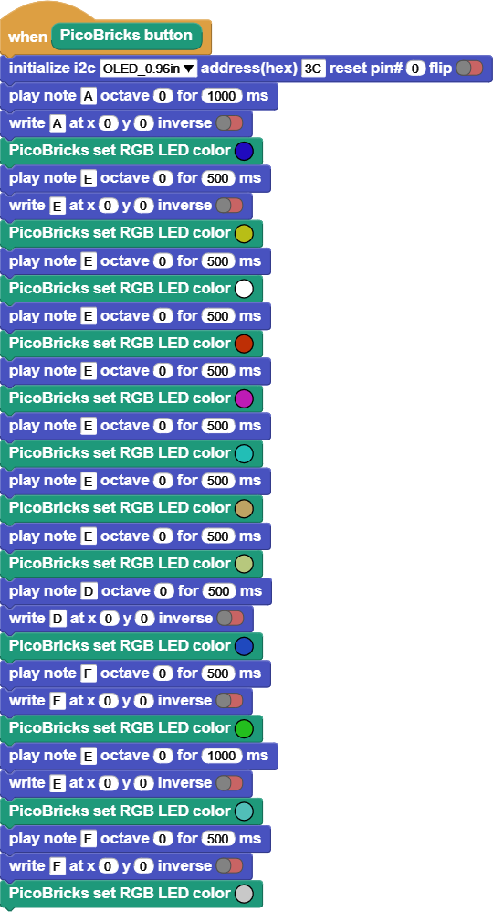

###########
Colourful Music
###########

Project Details and Algorithm
------------------------------
Let’s make a fun project by using the information we learned. In our project, we will use OLED screen, button, buzzer and RGB LED.

When the button is pressed, the notes given below will be played with buzzer, while which note is working at the same time will be written on the OLED screen and the color of RGB LED will change simultaneously with the notes.

Coding the Project with MicroBlocks
------------------------------------
+-----------------+
||colourful-music||     
+-----------------+

.. note::
  To code with MicroBlocks, simply drag and drop the image above to the MicroBlocks Run tab.
