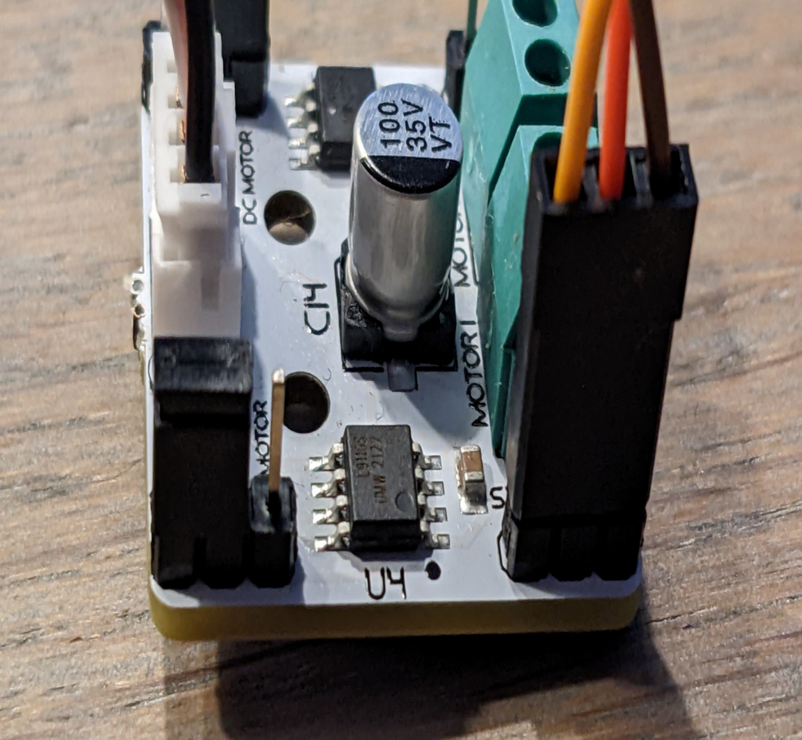
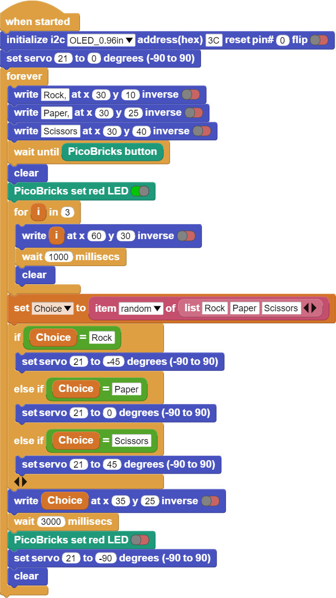

###########
Rock-Paper-Scissor
###########

Introduction
-------------
In this project, we will build a simple electronic rock-paper-scissors game by using Picobricks.

Project Details and Algorithm
------------------------------
This project is perfect for beginners, as it only requires a few components. While both the wiring diagram and the associated software are easy to understand.

RULES:

- Scissors cuts Paper

- Paper covers Rock

- Rock crushes Scissors

How could you make this nicer?

Think about :

- Add a bigger button

- Add a bigger OLED screen

- Use images instead of text

- Using a 3D printed arrow and board.

Use your imagination...

Wiring Diagram
--------------

+--------------------------------------+-------------------------------------------+
|  |rock-paper-scissors|               |   |rock-paper-scissors2|                  |
+--------------------------------------+-------------------------------------------+

.. |rock-paper-scissors| image:: _static/rock-paper-scissors.png

    

Coding the Project with MicroBlocks
------------------------------------
+----------------------+
||rock-paper-scissors1||     
+----------------------+

.. note::
  To code with MicroBlocks, simply drag and drop the image above to the MicroBlocks Run tab.
