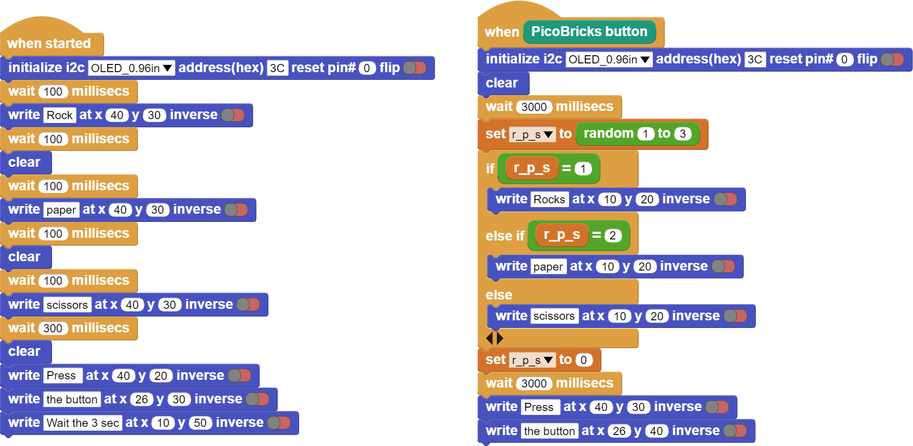

###########
Rock-Paper-Scissor
###########

Introduction
-------------
In this project, we will build a simple electronic rock-paper-scissors game by using Picobricks.

Project Details and Algorithm
------------------------------
This project is perfect for beginners, as it only requires a Picobricks.

RULES:

- Scissors cuts Paper

- Paper covers Rock

- Rock crushes Scissors

How could you make this nicer?

Think about :

- Add a bigger button

- Add a bigger OLED screen

- Use images instead of text

Use your imagination...
    

Coding the Project with MicroBlocks
------------------------------------
+---------------------+
||rock-paper-scissors||     
+---------------------+

.. note::
  To code with MicroBlocks, simply drag and drop the image above to the MicroBlocks Run tab.
