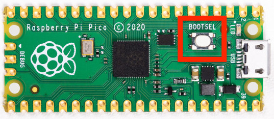
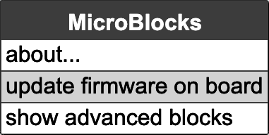
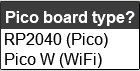

#############################################
MicroBlocks Block Programming Language
#############################################

What MicroBlocks Is?
--------------------

MicroBlocks is a free, Scratch-like blocks programming language for learning physical computing with educational microcontroller boards such as the micro:bit, Adafruit Circuit Playground Express, and many others. MicroBlocks is a live environment. Click on a block and it runs immediately, right on the board. Try out commands. See and graph sensor values in real time. No more waiting for code to compile and download. Want to display an animation while controlling a motor? No problem! MicroBlocks lets you write separate scripts for each task and run them at the same time. Your code is simpler to write and easier to understand. MicroBlocks runs on many different boards, but your scripts are portable. Buttons, sensors, and display blocks behave the same on all boards with the relevant hardware. Once you run the code in MicroBlocks, you can disconnect the USB and feed the Picobricks with a different power source. The code on the card will work automatically. 

To program Picobricks with MicroBlocks, let's open https://microblocks.fun/ in the browser (Google Chrome and Edge browsers are recommended).

.. figure:: ../_static/microblocks.png
    :align: center
    :width: 720
    :figclass: align-center
    
You don't need to install anything to run MicroBlocks in a Chrome or Edge browser; you can run the online editor by clicking the Run button in the menu at the top right of the screen. Alternatively, by clicking the Download button, you can download an off-line version suitable for your operating system and install it on your computer.

You can save MicroBlocks Web editor in your browser and use it without internet access. Run MicroBlocks in your browser to register the MicroBlocks Web app, then click the install button in the upper-right corner of your browser's URL bar.

.. figure:: ../_static/microblocks1.png
    :align: center
    :width: 720
    :figclass: align-center
    
IDE Introduction
--------------------
    
When you open the MicroBlocks program, you will see the IDE image shown below. You can review the explanation of the IDE components below. For a detailed and most current description of the IDE, please refer to our User Guide in our WIKI.

.. figure:: ../_static/microblocks3.png
    :align: center
    :width: 720
    :figclass: align-center

- Menu Bar: In this section, the first button from left to right allows us to change the language option of the program. The second button is the menu where we can see the operational settings of MicroBlocks and the firmware update selection,  while the third button offers the File related options. The fourth button opens a graph window used by the graph block to plot data, while the fifth rightmost button is used to connect to the  Picobricks via the USB interface..

- Block Categories: This field contains the categories of blocks used for programming in MicroBlocks. Categories are grouped using different colors. As the categories are selected, the relevant blocks will be listed in the Blocks Palette (Field 3).

- Blocks Palette: As selections are made in the Block categories field, blocks with specific functions will be listed in this field. code are written by dragging and dropping the blocks in this area to the Scripting area number 4.

- Scripting Area: This is the area where all coding activities take place. Users drag and drop blocks into this area to create scripts and custom blocks (functions).

- Start/Stop Buttons: This area contains two icons, Start and Stop, which are used to control the MicroBlocks programs.

- Library List: The contents of this area reflects the various libraries that are loaded depending on the requirements of the user scripts and micro devices.

MicroBlocks-Picobricks Connection and Operation
------------------------------------------------
- Connecting and Updating the Firmware in the Offline Editor

To connect Picobricks to the offline editor, you must connect the card to your computer with the USB cable while holding the white BOOTSEL button on the Raspberry Pi Pico.

    
Open the MicroBlocks offline editor and from the MicroBlocks menu, click the MicroBlocks button (gear icon), then click update firmware on board. 

    
    
You will be presented with a Pico board type selection. Select RP2040(Pico). Firmware installation will only take a few seconds and when finished, MicroBlocks will automatically connect to Picobricks.

