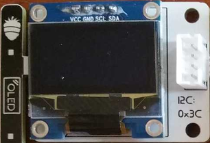

Guide for MicroBlocks
========================================

Summary of Blocks
------------------

For each block, there is a short description entry and a detailed block and component description. You can click on block pictures in the short description table to access the details and sample codes.

Sample codes on how to use the blocks have been provided. To try them out, all you have to do is open a browser session of the MicroBlocks IDE and drag and drop them onto the editor programming area. Then you can just click on them and see the results.

.. tip::

    To test any of the sample codes below, just drag and drop them onto the MicroBlocks IDE.

+--------------------------------------+-----------------------------------+
|  |linux-logo3|                       | |macos-logo3|                     |
+--------------------------------------+-----------------------------------+
|Sets the RGB LED to the selected color| Returns the temperature in Celsius|
+--------------------------------------+-----------------------------------+

+------------------------------------+----------------------------------+
||windows-logo|                      | |linux-logo|                     | 
+------------------------------------+----------------------------------+
| Makes a beep sound from the speaker| Returns the button status as 1/0 | 
+------------------------------------+----------------------------------+

.. |linux-logo| image:: _static/pb_button.png
.. |macos-logo| image:: _static/pb_color.png

+--------------------------------------+-----------------------------------+
||windows-logo1|                       |  |macos-logo1|                    |
+--------------------------------------+-----------------------------------+
| Returns the humidity percentage value|  Returns the potentiometer value. |
+--------------------------------------+-----------------------------------+

.. |linux-logo1| image:: _static/pb_lightsensorr.png
.. |macos-logo1| image:: _static/pb_potentiometer.png

+------------------------------------+-------------------------+
| |windows-logo2|                    | |linux-logo2|           | 
+------------------------------------+-------------------------+
| Sets the RGB LED to a random color | Sets the red LED as 1/0 |
+------------------------------------+-------------------------+

.. |linux-logo2| image:: _static/pb_redled.png
.. |macos-logo2| image:: _static/pb_relay.png

.. |windows-logo3| image:: _static/pb_setmotor.png
.. |linux-logo3| image:: _static/pb_setrgbcolor.png

.. |windows-logo4| image:: _static/pb_turnoffrgb.png
.. |linux-logo4| image:: _static/pb_initpins.png

+----------------------+-----------------------+
| |windows-logo3|      | |macos-logo2|         |
+----------------------+-----------------------+
|Controls the DC motors| Sets the relay as 1/0 |
+----------------------+-----------------------+

+--------------------------+-----------------------------------------------+
||macos-logo|              ||linux-logo1|                                  |
+--------------------------+-----------------------------------------------+
|Returns a RGB color value | Returns the light level as a percentage value |
+--------------------------+-----------------------------------------------+

+---------------------+
||windows-logo4|      |
+---------------------+
|Turns off the RGB LED| 
+---------------------+

Working with Library Blocks
-----------------------------

The library consists of a set of simple services, that together allow the user to have complete control of the PicoBricks Board and the modules on it.

PicoBricks Library has two distinct types of block shapes:

* oval: these are ``reporter blocks`` that return some kind of information back. The user would normally either assign these to a project variable or use it in a suitable input slot of other blocks. The return information type can be any of the supported data types.

* rectangular: these are ``command blocks`` that perform a programmed function and do not return any information.

Notes on Library Components
----------------------------

PicoBricks board contains ten components premounted. The Library, however, only has blocks for seven of them; the OLED screen, Motor Control, and Wireless Comm components are ``not directly covered`` by the library.

In this section, we will describe how one can make use of these components, as well as some special information about them.

* OLED display module is programmed by using the MicroBlocks graphics library called OLED Graphics. It is located under ``Libraries+ / Graphics / OLED Graphics.ubl`` in the IDE.

.. note::
    For details of the library blocks and operations, refer to  `OLED Library <https://wiki.microblocks.fun/extension_libraries/oled>`_

.. tip::
    For a project that describes advanced use of the library and data transfer, please refer to `SNAP to MicroBlocks <https://wiki.microblocks.fun/snap/snap2mb_img_code>`_

* MOTOR module is used to control SERVO motors and DC motors.DC Motor support is provided in the library directly. However, there is a caveat: since the motor connections are only via thee-wire cable, it is not possible to programmatically reverse the direction of the DC motors. The only way to change the direction of the DC motors is to change the way the wires are connected.

.. figure:: ../_static/pb_motor_module.png
    :align: center
    :width: 320
    :figclass: align-center

.. warning::
    SERVO motor programming is supported via the MicroBlocks library Servo. It is located under Libraries+ / Servo.ubl in the IDE.    
    
.. note::
   For a detailed project that uses the DC and Servo motors, please refer to  `PicoBricks Servo and DC Motor Control <https://wiki.microblocks.fun/picobricks/motorservo>`_

* WIRELESS COMM Module enables PicoBricks to communicate with other environments using either a WIFI module or a Bluetooth module and is connected to the Serial IO ports of the Pico.

.. figure:: ../_static/pb_wireless_module.png
    :align: center
    :width: 320
    :figclass: align-center

Projects with MicroBlocks
----------------------------

.. image:: /../_static/pb.gif

| **MicroBlocks is a live programming system that invites exploration. Click a block in the MicroBlocks IDE to see text appear.**

.. image:: /../_static/pb1.gif

| **Beginners and experts alike will find that MicroBlocks is a great tool exploring every aspect of PicoBricks.**

.. image:: /../_static/pb2.gif

