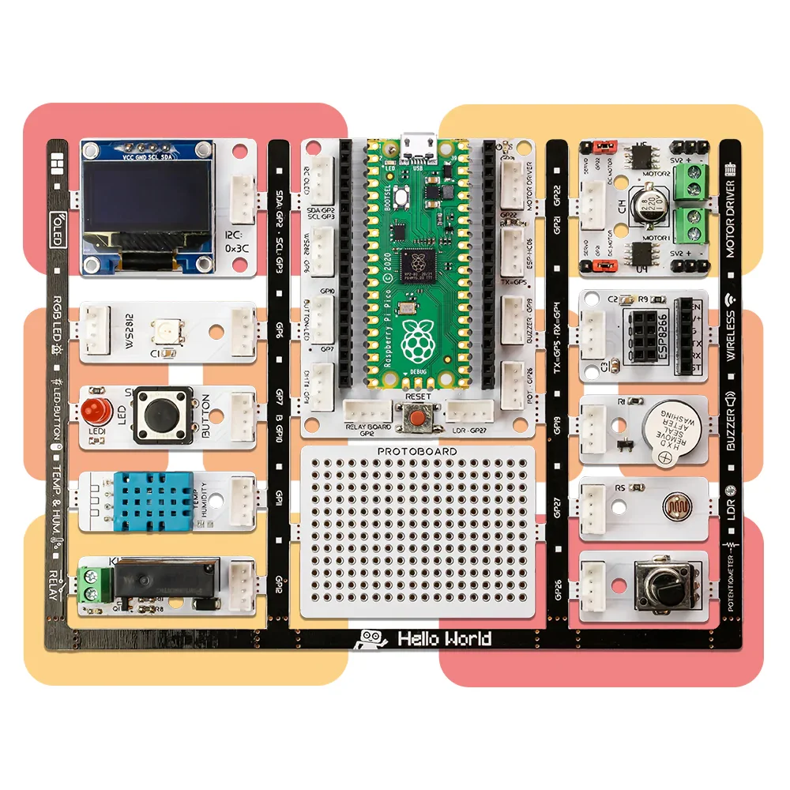

What is PicoBricks?
====================

Pico Bricks is an electronic development board + software which is designed for use in maker projects. With ten detachable modules included, Pico Bricks can be used to create a wide variety of projects. It also includes a protoboard that you can use to add your own modules!
Pico Bricks is for everyone interested in electronics and coding. Beginners with no prior experience will find it easy to get started thanks to the modular hardware design, Scratch-like block coding environment, and simulator. Those with experience can dig more deeply into electronics or explore coding in Python. And even the most expert makers will appreciate how quickly they can explore ideas and create prototypes with Pico Bricks.
Unlike other boards, Pico Bricks has an incredible amount of flexibility for every level of makers! Bricks IDE has example code for different scenarios.

Learn coding from zero to hero with MicroBlocks or the Pico Bricks's drag-n-drop, block coding builder. MicroBlocks is the easiest coding experience ever created and widely known in the maker industry.

+------------+
||picobricks||     
+------------+

