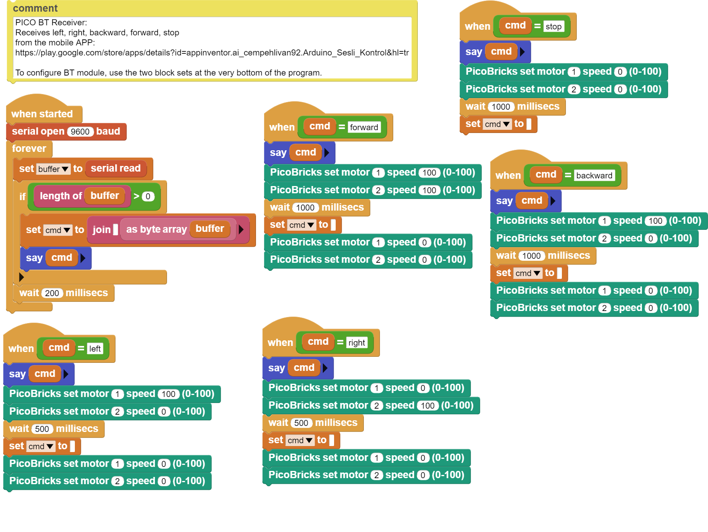

###########
Voice Controlled Car
###########

Introduction
-------------
In the project, the robot car kit that comes out of the set will be assembled and controlled via mobile phone.

Project Details and Algorithm
------------------------------

Developing and continuing to develop artificial intelligence applications recognize human characteristics, learn and try to behave like people. We can express ``artificial intelligence`` as software that can learn in its shortest form. Sometimes it learns the image, sometimes the sound, and sometimes by using the data it collects from the sensors. It does this thanks to the algorithms determined by the developers, and it helps in the decision-making processes in the areas it is used according to the results it has achieved. In short, artificial intelligence applications are now used in situations where the decision-making process needs to be done quickly and without errors. From the marketing field to the defense industry, from education to health, from economy to entertainment, artificial intelligence increases efficiency and reduces costs. In this project we will do with PicoBricks, we will make a 2WD car that you can control by talking. PicoBricks allows you to communicate wirelessly with 2 6V DC motors and bluetooth.

The HC05 bluetooth module is a module that enables us to communicate wirelessly between PicoBricks and a mobile phone. Thanks to the mobile application installed on the mobile phone in the project, the commands sent from the phone will be transmitted to PicoBricks via the HC05 module and the robot car will move according to these data. We can direct the robot car with the forward, backward, right, left buttons from the mobile phone, as well as send data to PicoBricks with voice command. In the project, we will give voice commands to control the movements of the robot car.

Wiring Diagram
--------------

.. figure:: ../_static/voice-controlled-car.png      
    :align: center
    :width: 400
    :figclass: align-center
    

You can program and run Picobricks modules without any wiring. If you are going to use the modules by separating them from the board, then you should make the module connections with the Grove cables provided.

MicroPython Code of the Project
--------------------------------
.. code-block::

    from machine import Pin, UART
    from utime import sleep

    uart = UART(0,9600) #If connection cannot be established, try 115200.
    m1 = Pin(21, Pin.OUT)
    m2 = Pin(22, Pin.OUT)

    m1.low()
    m2.low()

    while True:
    sleep(0.05)
    if uart.any():
        cmd = uart.readline()
    if cmd==b'F':
        m1.high()
        m2.high()
    elif cmd==b'R':
        m1.high()
        m2.low()
    elif cmd==b'L':
        m1.low()
        m2.high()
    elif cmd==b'S':
        m1.low()
        m2.low()
    cmd=""
            

.. tip::
  If you rename your code file to main.py, your code will run after every boot.
   
Arduino C Code of the Project
-------------------------------

.. code-block::

    void setup() {
    Serial1.begin(9600);
        }

    void loop() {
    if (Serial1.available() > 0) {
 
      char sread = Serial1.read();
      Serial.println(sread);
      
      if (sread == 'f') {
      Forward();
        } 
      else if(sread == 'r'){
      Turn_Right();
        } 
      else if(sread == 'l'){
      Turn_Left();
        } 
      else if(sread == 's'){
      Stop();
        }
        }
        }

      void Forward(){
      digitalWrite(21,HIGH);
      digitalWrite(22,HIGH);
      delay(1000);
      digitalWrite(21,LOW);
      digitalWrite(22,LOW);
        }
      void Turn_Left(){
      digitalWrite(21,LOW);
      digitalWrite(22,HIGH);
      delay(500);
      digitalWrite(21,LOW);
      digitalWrite(22,LOW);
        }
      void Turn_Right(){
      digitalWrite(21,HIGH);
      digitalWrite(22,LOW);
      delay(500);
      digitalWrite(21,LOW);
      digitalWrite(22,LOW);
        }
      void Stop(){
      digitalWrite(21,LOW);
      digitalWrite(22,LOW);
      delay(1000);
        }

Coding the Project with Microblocks
------------------------------------

+-----------------------+
||voice-controlled-car2||     
+-----------------------+

.. note::
  To code with MicroBlocks, simply drag and drop the image above to the MicroBlocks Run tab.
  

    
