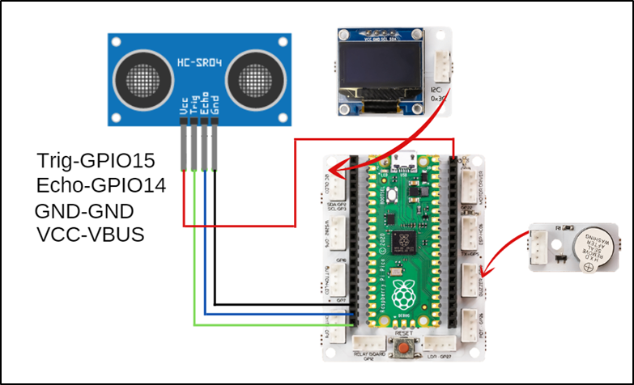
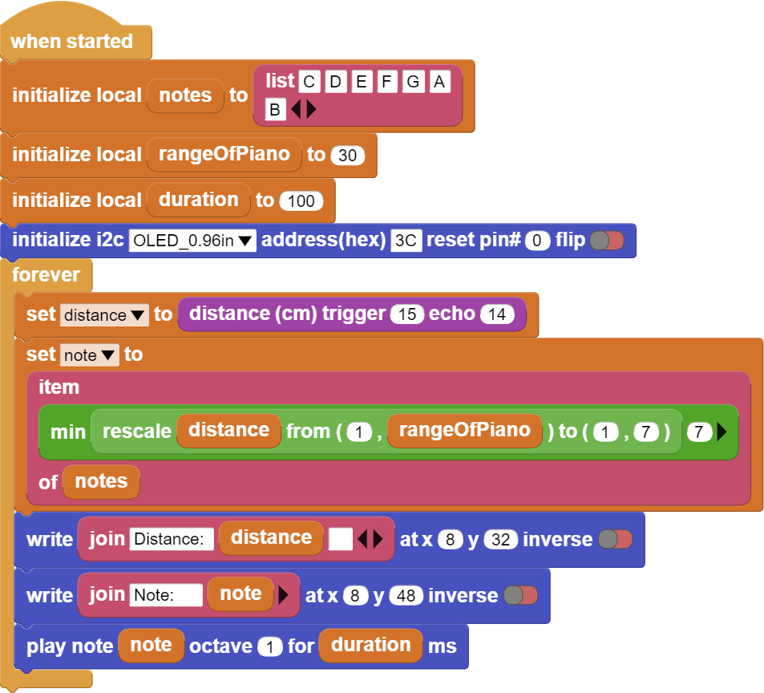

###########
Air Piano
###########

Introduction
-------------
In this project we will make a simple piano that can play 8 notes with PicoBricks.

Project Details and Algorithm
------------------------------

With the development of electronic technology, musical instruments that are difficult to produce, expensive and producing high-quality sound have been digitized. Pianos are one of these instruments. Each key of digital pianos produces electrical signals at a different frequency. Thus, it can play 88 different notes from its speakers. Factors such as the delay time of the keys of digital instruments, the quality of the speaker, the resolution of the sound have appeared as the factors affecting the quality. In electric guitars, vibrations in strings are digitized instead of keys. On the other hand, In wind instruments, the notes played can be converted into electrical signals and recorded thanks to the high-resolution microphones plugged into the sound output. This development in electronic technology has facilitated access to high-cost musical instruments, music education has gained a wider variety and spread to a wider audience.

The speaker of this piano will be the buzzer. The ultrasonic sensor will act as the keys of the piano. In this project, we will make a piano application using the 
``HC-SR04 Ultrasonic distance sensor`` and the ``buzzer module`` on PicoBricks. We will make the buzzer play different notes according to the values coming from the distance sensor, and we will create melodies by moving our hand closer to the sensor and away from it. In addition, we will instantly print the distance played note information on the OLED screen.

Wiring Diagram
--------------

    

You can program and run Picobricks modules without any wiring. If you are going to use the modules by separating them from the board, then you should make the module connections with the Grove cables provided.

MicroPython Code of the Project
--------------------------------
.. code-block::

    from machine import Pin, PWM, I2C
    from utime import sleep
    import utime       
    from picobricks import SSD1306_I2C  
    import _thread
    #define the libraries

    buzzer=PWM(Pin(20,Pin.OUT))
    trigger = Pin(15, Pin.OUT)
    echo = Pin(14, Pin.IN)
    #define the input and Output pins

    WIDTH  = 128                                            
    HEIGHT = 64
    #OLED screen settings

    sda=machine.Pin(4)
    scl=machine.Pin(5)
    i2c=machine.I2C(0,sda=sda, scl=scl, freq=1000000)
    #initialize digital pin 4 and 5 as an OUTPUT for OLED communication

    oled = SSD1306_I2C(WIDTH, HEIGHT, i2c)

    measure=0

    def getDistance():
    trigger.low()
    utime.sleep_us(2)
    trigger.high()
    utime.sleep_us(5)
    trigger.low()
    while echo.value() == 0:
       signaloff = utime.ticks_us()
    while echo.value() == 1:
       signalon = utime.ticks_us()
    timepassed = signalon - signaloff
    distance = (timepassed * 0.0343) / 2
    return distance
    #calculate distance

    def airPiano():
    while True:
        global measure
        
        if measure>5 and measure<11:
            buzzer.duty_u16(4000)
            buzzer.freq(262)
            sleep(0.4)
           
        elif measure>10 and measure<16:
            buzzer.duty_u16(4000)
            buzzer.freq(294)
            sleep(0.4)
            
        elif measure>15 and measure<21:
            buzzer.duty_u16(4000)
            buzzer.freq(330)
            sleep(0.4)
            
        elif measure>20 and measure<26:
            buzzer.duty_u16(4000)
            buzzer.freq(349)
            sleep(0.4)
            
        elif measure>25 and measure<31:
            buzzer.duty_u16(4000)
            buzzer.freq(392)
            sleep(0.4)
            
        elif measure>30 and measure<36:
            buzzer.duty_u16(4000)
            buzzer.freq(440)
            sleep(0.4)
            
        elif measure>35 and measure<41:
            buzzer.duty_u16(4000)
            buzzer.freq(494)
            sleep(0.4)
        else:
            buzzer.duty_u16(0)

    _thread.start_new_thread(airPiano, ())
    #play the tone determined by the value of the distance sensor

    while True:
    measure=int(getDistance())
    oled.text("Distance " + str(measure)+ " cm", 5,30)
    oled.show()
    sleep(0.01)
    oled.fill(0)
    oled.show()
    #write the specified texts to the determined x and ye coordinates on the OLED screen

.. tip::
  If you rename your code file to main.py, your code will run after every boot.
   
Arduino C Code of the Project
-------------------------------

.. code-block::

    #include <Wire.h>
    #include "ACROBOTIC_SSD1306.h"
    #include <NewPing.h>

    #define TRIGGER_PIN  15
    #define ECHO_PIN     14
    #define MAX_DISTANCE 400

    NewPing sonar(TRIGGER_PIN, ECHO_PIN, MAX_DISTANCE);

    #define T_C 262
    #define T_D 294
    #define T_E 330 
    #define T_F 349
    #define T_G 392
    #define T_A 440
    #define T_B 493

    const int Buzzer = 20;

    void setup() {
    pinMode(Buzzer,OUTPUT);

    Wire.begin();  
    oled.init();                      
    oled.clearDisplay(); 

    #if defined(__AVR_ATtiny85__) && (F_CPU == 16000000)
    clock_prescale_set(clock_div_1);
    #endif
        }

    void loop() {

    delay(50);
    int distance=sonar.ping_cm();

    if(distance>5 & distance<11)
        {
    tone(Buzzer,T_C);
        }

    else if(distance>10 & distance<16)
        {
    tone(Buzzer,T_D);
        }

    else if(distance>15 & distance<21)
        {
    tone(Buzzer,T_E);
        }

    else if(distance>20 & distance<26)
        {
    tone(Buzzer,T_F);
        }

    else if(distance>25 & distance<31)
        {
    tone(Buzzer,T_G);
        }

    else if(distance>30 & distance<36)
        {
    tone(Buzzer,T_A);
        }

    else if(distance>35 & distance<41)
        {
    tone(Buzzer,T_B);
        }

    else 
        {
    noTone(Buzzer);
        }

    oled.clearDisplay();
    oled.setTextXY(2,4);              
    oled.putString("Distance: ");
    oled.setTextXY(4,6);              
    String string_distance=String(distance);
    oled.putString(string_distance);
    oled.setTextXY(4,8);              
    oled.putString("cm");
        }
    
    
Coding the Project with MicroBlocks
------------------------------------
+------------+
||air-piano1||     
+------------+

.. note::
  To code with MicroBlocks, simply drag and drop the image above to the MicroBlocks Run tab.
  

    
