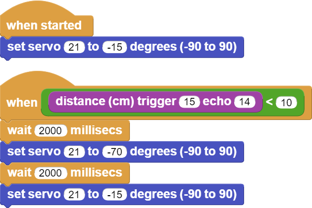

###########
Automatic Trash Bin
###########

Introduction
-------------
In this project, you will make a mobile and automatic stylish trash bin for your room using an ultrasonic sensor and servo motor with PicoBricks.

Project Details and Algorithm
------------------------------

The Covid 19 pandemic has changed people's daily routines in many areas. In many areas such as cleaning, working, shopping and social life, people were introduced to a series of new rules that they had to comply with. Covid-19 has LED to the development of new business areas as well as some products to stand out. At a time when hand hygiene was very important, no one wanted to touch the lid of the trash can to throw away their garbage. When approached, the lids of which open automatically and when it is full, the trash bins, which make bags ready to be thrown away, found buyers at prices far above their cost. In addition, automatic disinfectant machines provided contactless hygiene by pouring a certain amount of liquid into our palms when we held them under our hands. Automatic disinfectant machines took place on the shelves at prices well above their cost. These two products have similarities in terms of working system. In automatic disinfectant machines, a pump with an electric motor directly transfers the liquid, and some models have devices based on the pumping system with the power of the servo motor. In automatic trash bins, a servo motor that opens the lid was used, and infrared or ultrasonic sensors were used to detect hand movement.

HC-SR04 ultrasonic distance sensor and SG90 servo motor will be used in this project. When the user puts his hand in front of the lid of the trash can, the distance sensor will detect the proximity and send it to the Picobricks. According to this information, Picobricks will open the lid of the garbage can by running a servo motor and will lower it again after a short while.

Wiring Diagram
--------------

.. figure:: ../_static/automatic-trash-bin.png      
    :align: center
    :width: 400
    :figclass: align-center
    

You can program and run Picobricks modules without any wiring. If you are going to use the modules by separating them from the board, then you should make the module connections with the Grove cables provided.

MicroPython Code of the Project
--------------------------------
.. code-block::

    from machine import Pin, PWM
    from utime import sleep

    servo=PWM(Pin(21,Pin.OUT))
    trigger = Pin(15, Pin.OUT)
    echo = Pin(14, Pin.IN)

    servo.freq(50)
    servo.duty_u16(1920) #15 degree

    def getDistance():
    trigger.low()
    utime.sleep_us(2)
    trigger.high()
    utime.sleep_us(5)
    trigger.low()
    while echo.value() == 0:
       signaloff = utime.ticks_us()
    while echo.value() == 1:
       signalon = utime.ticks_us()
    timepassed = signalon - signaloff
    distance = (timepassed * 0.0343) / 2
    print("The distance from object is ",distance,"cm")
    return distance

    while True:
    sleep(0.01)
    if int(getDistance())<=10:
        servo.duty_u16(4010) #70 degree
        utime.sleep(0.3)
        servo.duty_u16(1920)
        

.. tip::
  If you rename your code file to main.py, your code will run after every boot.
   
Arduino C Code of the Project
-------------------------------

.. code-block::

    #include <Servo.h>
    #define trigPin 14
    #define echoPin 15
    Servo servo;
    void setup() {
    Serial.begin (9600);
    pinMode(trigPin, OUTPUT);
    pinMode(echoPin, INPUT);
    servo.attach(21);
        }

    void loop() {
    long duration, distance;
    digitalWrite(trigPin, LOW);
    delayMicroseconds(2);
    digitalWrite(trigPin, HIGH);
    delayMicroseconds(10);
    digitalWrite(trigPin, LOW);
    duration = pulseIn(echoPin, HIGH);
    distance = (duration/2) / 29.1; 
    if (distance < 80) {
    Serial.print(distance);
    Serial.println(" cm");
    servo.write(179);
        }

    else if (distance<180) {
    Serial.print(distance);
    Serial.println(" cm");
    servo.write(100); 
        }
  

        }

Coding the Project with MicroBlocks
------------------------------------
+----------------------+
||automatic-trash-bin1||     
+----------------------+

.. note::
  To code with MicroBlocks, simply drag and drop the image above to the MicroBlocks Run tab.
  

    
