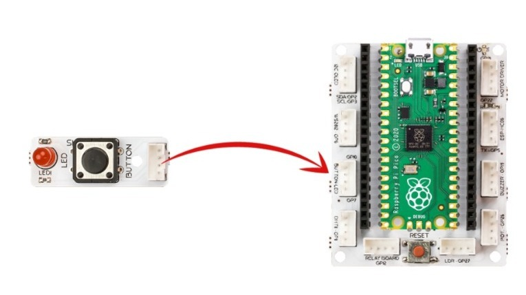
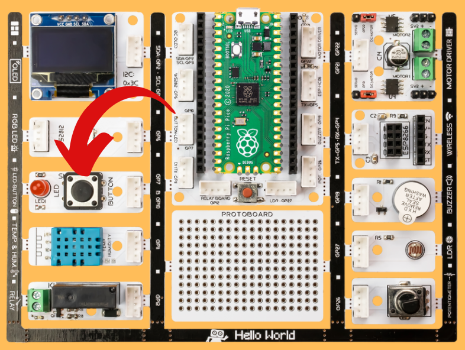

###########
Blink
###########

Introduction
-------------
In real life, the employee, who has just started to learn the job, first undertakes the most basic task.The cleaner first learns to use the broom, the cook learns to use the kitchen utensils, the waiter to carry a tray. We can come up with many examples. The first code written by newcomers to software development is known as ``"Hello World"``. Printing "Hello World" as soon as the program starts on the screen or console window in the language they use is the first step in programming. Like a baby starting to crawl… 

.. doctest::
   :hide:
   
  >>> print("Hello World")
  >>> Hello World
   
The first step in physical computing is the Blink application: controlling the on/off status of a LED. By simply connecting an LED to the microprocessor board, the code keeps the LED blinking continuously. Ask people who have developed themselves in the field of robotics programming how they got to this level. The answer they will give you starts like this; it all started with a flashing LED! 

LEDs are the language of electronic devices. Thanks to the LEDs, the programmer tells the users at which stage of the task the device is, what the problem is, if any, and which options are active. In this project, you will learn the types of LEDs on the Picobricks and learn how to turn them on and off.

Project Details and Algorithm
------------------------------

There are 1 x 5mm red LED and 1 x WS2812B RGB LED on Picobricks. While normal LEDs light up in one color, RGB LEDs can light up in many different colors. In this project we will use the red LED on PicoBricks.

We will write code to turn on the red LED and turn it off after a certain time. We will adjust our code to repeat this process continuously.

Wiring Diagram
--------------

    

You can program and run Picobricks modules without any wiring. If you are going to use the modules by separating them from the board, then you should make the module connections with the Grove cables provided.

MicroPython Code of the Project
--------------------------------
.. code-block::

   from machine import Pin #to access the hardware 
   on the pico
   import utime #time library
   led = Pin(7,Pin.OUT) #initialize digital pin 7 as an output for LED
   while True: #while loop
       led.toggle() #LED on&off status
       utime.sleep(0.5) #wait for a half second

.. tip::
  If you rename your code file to main.py, your code will run after every boot.
   
Arduino C Code of the Project
-------------------------------

.. code-block::

 void setup() {
  // put your setup code here, to run once:
 pinMode(7,OUTPUT); // initialize digital pin 7 as an output
  }
  void loop() {
   // put your main code here, to run repeatedly:
     digitalWrite(7,HIGH); //turn the LED on by making the voltage HIGH  
     delay(500); //wait for a half second                   
     digitalWrite(7,LOW); //turn the LED on by making the voltage LOW
     delay(500); //wait for a half second                    
  }

Coding the Project with MicroBlocks
------------------------------------

1) Drag and drop the ``when started block`` from the ``Control`` category to the Scripting area. 

This block executes the code under it whenever the Start button is clicked

.. figure:: ../_static/blink33.png      
    :align: center
    :width: 220
    :figclass: align-center
2) Then, drag the ``forever`` block from the ``Control`` category and add it under the when started block. 

Forever block will execute the blocks placed within it non-stop (forever, as the name implies).

.. figure:: ../_static/blink4.png      
    :align: center
    :width: 220
    :figclass: align-center

3) Drag the PicoBricks ``set red LED block`` and drop it into the ``forever`` block.The boolean TRUE (green) selection in the block will make the LED turn on. Alternatively, the FALSE (red) selection will make the LED go off.

Test if the red LED is lit by pressing the ``start`` button

.. figure:: ../_static/blink5.png      
    :align: center
    :width: 220
    :figclass: align-center
    
4) Now, to turn off the red LED, click once on the boolean control in the block to set it to red. This setting means FALSE and should turn off the LED.

Test whether the LED goes out by pressing the Start button again.
    
.. figure:: ../_static/blink6.png      
    :align: center
    :width: 220
    :figclass: align-center    
    
    
5) Now, we will modify our code to make the LED go on and off by itself at certain time intervals. 

Drag the ``wait 500 millisecs`` block from the ``Control`` category and add it below the ``PicoBricks set red LED`` block.

.. figure:: ../_static/blink7.png      
    :align: center
    :width: 220
    :figclass: align-center    

6) Then add the ``Picobricks set red LED block`` again under the ``wait 500 millisecs`` block and set the boolean control to False. 

Add another wait ``500 millisecs`` block to the bottom. 

When you press the ``start`` button, you will see the red LED blink at 500 millisecond intervals. 
The number 500 in the ``wait 500 millisecs`` block represents milliseconds. You can change this number as you wish. One second is 1000 milliseconds.

.. figure:: ../_static/blink8.png      
    :align: center
    :width: 220
    :figclass: align-center    

    
