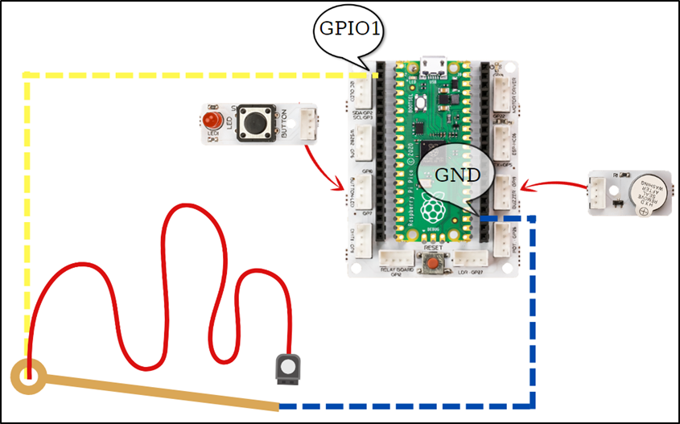

###########
Buzz Wire Game
###########

Introduction
-------------
In this project, we will electronically prepare the attention and concentration developer Buzz Wire Game with the help of a conductor wire using the buzzer and LED module with Picobricks. While preparing this project, you will have learned an input technique that is not a button but will be used like a ``button``.

Project Details and Algorithm
------------------------------

Projects don't always have to be about solving problems and making things easier. You can also prepare projects to have fun and develop yourself. Attention and concentration are features that many people want to develop. The applications that we can do with this are quite interesting. How about making Buzz Wire Game with Picobricks? You must have heard the expression that computers work with 0s and 1s. 0 represents the absence of electricity and 1 represents its presence. 0 and 1’s come together with a certain number and sequence of combinations to form meaningful data. In electronic systems, 0s and 1s can be used to directly control a situation. Is the door closed or not? Is the light on or off? Is the irrigation system on or not? In order to obtain such information, a status check is carried out. In this project, we will electronically prepare the attention and concentration developer Buzz Wire Game with the help of a conductor wire using the buzzer and LED module with Picobricks. While preparing this project, you will have learned an input technique that is not a button but will be used like a button.

To prepare the project, you need 2 male-male jumper cables and a 15 cm long conductor bendable wire. When the player is ready, it will be asked to press the button to start the game. If the jumper cable touches the conductor wire in the player’s hand when the button is pressed, Picobricks will detect this and give an audible and written warning. The time from the start of the game to the end will also be displayed on the OLED screen. We reset the timer after the user presses the button. Then we will give a voltage of 3.3V to the conductor wire connected to the GPIO1 pin of Picobricks. One end of the cable held by the player will be connected to the GND pin on the Picobricks. If the player touches the jumper cable in his hand to the conductive wire, the GPIO1 pin will drop to the ``Passive/Off/0 position``. Then, it will announce that the game is over, and there will be light, written and audio feedback, then the elapsed time will be shown on the OLED screen in milliseconds. After 5 seconds, the player will be prompted to press the button to restart.

Wiring Diagram
--------------

    

You can program and run Picobricks modules without any wiring. If you are going to use the modules by separating them from the board, then you should make the module connections with the Grove cables provided.

MicroPython Code of the Project
--------------------------------
.. code-block::

    from machine import Pin, I2C, Timer #to access the hardware on the pico
    from picobricks import SSD1306_I2C #OLED Screen Library
    from utime import sleep # time library

    #OLED Screen Settings
    WIDTH  = 128                                            
    HEIGHT = 64

    sda=machine.Pin(4)#initialize digital pin 4 and 5 as an OUTPUT for OLED Communication
    scl=machine.Pin(5)
    i2c=machine.I2C(0,sda=sda, scl=scl, freq=1000000)
    oled = SSD1306_I2C(WIDTH, HEIGHT, i2c)

    wire=Pin(1,Pin.OUT)#initialize digital pin 1 as an OUTPUT 
    led = Pin(7,Pin.OUT)#initialize digital pin 7 and 5 as an OUTPUT for LED
    buzzer=Pin(20, Pin.OUT)#initialize digital pin 20 as an OUTPUT for Buzzer
    button=Pin(10,Pin.IN,Pin.PULL_DOWN)#initialize digital pin 10 as an INPUT for button
    endtime=0

    while True:
    led.low()
    oled.fill(0)
    oled.show()
    oled.text("<BUZZ WIRE GAME>",0,0)
    oled.text("Press the button",0,17)
    oled.text("TO START!",25,35)
    oled.show()
    #When button is '0', OLED says 'GAME STARTED'
    while button.value()==0:
        print("press the button")
    oled.fill(0)
    oled.show()
    oled.text("GAME",25,35)
    oled.text("STARTED",25,45)
    oled.show()
    wire.high()
    timer_start=utime.ticks_ms()
     #When wire is '1', OLED says 'GAME OVER'
    while wire.value()==1:
        print("Started")
    endtime=utime.ticks_diff(utime.ticks_ms(), timer_start)
    print(endtime)
    oled.fill(0)
    oled.show()
    oled.text("GAME OVER!",25,35)
    oled.text(endtime + "ms" ,25,45)
    oled.show()
    led.high()#LED On
    buzzer.high()#Buzzer On
    sleep(5)#Delay
            

.. tip::
  If you rename your code file to main.py, your code will run after every boot.
   
Arduino C Code of the Project
-------------------------------

.. code-block::

    #include <Wire.h>
    #include "ACROBOTIC_SSD1306.h"

    int Time=0;
    unsigned long Old_Time=0;

    void setup() {
    // put your setup code here, to run once:
    pinMode(20,OUTPUT);
    pinMode(7,OUTPUT);
    pinMode(1,OUTPUT);
    pinMode(10,INPUT);

    Wire.begin();  
    oled.init();                      
    oled.clearDisplay();
   
    #if defined(__AVR_ATtiny85__) && (F_CPU == 16000000)
    clock_prescale_set(clock_div_1);
    #endif  

        }

    void loop() {
    // put your main code here, to run repeatedly:
    digitalWrite(7,LOW);

    oled.setTextXY(2,1);              
    oled.putString("BUZZ WIRE GAME"); 
    oled.setTextXY(4,2);              
    oled.putString("Press Button"); 
    oled.setTextXY(5,3);              
    oled.putString("TO START!");

    while (!(digitalRead(10)==1)){
    
        }

    oled.clearDisplay();
    oled.setTextXY(3,6);              
    oled.putString("GAME"); 
    oled.setTextXY(5,4);              
    oled.putString("STARTED");

    digitalWrite(1,HIGH);
    Old_Time=millis();
  
    while(!(digitalRead(1)==0)){

    Time=millis()-Old_Time;   
        }

    String(String_Time)=String(Time);
  
    oled.clearDisplay();
    oled.setTextXY(3,4);              
    oled.putString("GAME OVER"); 
    oled.setTextXY(5,4);              
    oled.putString(String_Time);
    oled.setTextXY(5,10);              
    oled.putString("ms"); 

    digitalWrite(7,HIGH);
    digitalWrite(20,HIGH);
    delay(500);
    digitalWrite(20,LOW);
    delay(5000);
  
    Time=0;
    Old_Time=0;
    oled.clearDisplay();

        }

Coding the Project with MicroBlocks
------------------------------------

+-----------------+
||buzz-wire-game1||     
+-----------------+

.. |buzz-wire-game1| image:: _static/buzz-wire-game1.png

.. note::
  To code with MicroBlocks, simply drag and drop the image above to the MicroBlocks Run tab.
  

    
