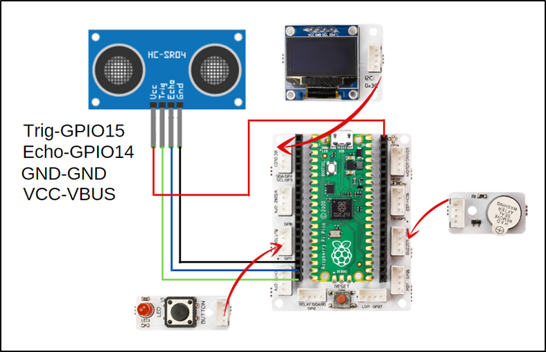

###########
Digital Ruler
###########

Introduction
-------------
In this project, you will learn how to receive and react to a command from the user in your projects by coding the button-LED module of Picobricks.

Project Details and Algorithm
------------------------------

As Newton explained in his laws of motion, a reaction occurs against every action. Electronic systems receive commands from users and perform their tasks. Usually a keypad, touch screen or a button is used for this job. Electronic devices respond verbally, in writing or visually to inform the user that their task is over and what is going on during the task. In addition to informing the user of these reactions, it can help to understand where the fault may be in a possible malfunction.

Different types of buttons are used in electronic systems. Locked buttons, push buttons, switched buttons... There is 1 push button on Picobricks. They work like a switch, they conduct current when pressed and do not conduct current when released. In the project, we will understand the pressing status by checking whether the button conducts current or not. If it is pressed, it will light the LED, if it is not pressed, we will turn off the LED.

Wiring Diagram
--------------

    

You can program and run Picobricks modules without any wiring. If you are going to use the modules by separating them from the board, then you should make the module connections with the Grove cables provided.

MicroPython Code of the Project
--------------------------------
.. code-block::

    from machine import Pin, PWM, I2C
    from utime import sleep
    from picobricks import SSD1306_I2C
    import utime
    #define the libraries
    redLed=Pin(7,Pin.OUT)
    button=Pin(10,Pin.IN,Pin.PULL_DOWN)
    buzzer=PWM(Pin(20,Pin.OUT))
    buzzer.freq(392)
    trigger = Pin(15, Pin.OUT)
    echo = Pin(14, Pin.IN)
    #define input and output pins
    WIDTH  = 128                                            
    HEIGHT = 64                                       
    #OLED screen settings
    sda=machine.Pin(4)
    scl=machine.Pin(5)
    i2c=machine.I2C(0,sda=sda, scl=scl, freq=1000000)
    #initialize digital pin 4 and 5 as an OUTPUT for OLED communication
    oled = SSD1306_I2C(128, 64, i2c)
    measure=0
    finalDistance=0

    def getDistance():
    trigger.low()
    utime.sleep_us(2)
    trigger.high()
    utime.sleep_us(5)
    trigger.low()
    while echo.value() == 0:
       signaloff = utime.ticks_us()
    while echo.value() == 1:
       signalon = utime.ticks_us()
    timepassed = signalon - signaloff
    distance = (timepassed * 0.0343) / 2
    return distance
    #calculate the distance
    def getMeasure(pin):
    global measure
    global finalDistance
    redLed.value(1)
    for i in range(20):
        measure += getDistance()
        sleep(0.05)
    redLed.value(0)
    finalDistance = (measure/20) + 1
    oled.fill(0)
    oled.show()
    oled.text(">Digital Ruller<", 2,5)
    oled.text("Distance " + str(round(finalDistance)) +" cm", 0, 32)
    oled.show()
    #print the specified distance to the specified x and y coordinates on the OLED screen
    print(finalDistance)
    buzzer.duty_u16(4000)
    sleep(0.05)
    buzzer.duty_u16(0)
    measure=0
    finalDistance=0
    #sound the buzzer  
    button.irq(trigger=machine.Pin.IRQ_RISING, handler=getMeasure)

.. tip::
  If you rename your code file to main.py, your code will run after every boot.
   
Arduino C Code of the Project
-------------------------------

.. code-block::

    #include <Wire.h>
    #include "ACROBOTIC_SSD1306.h"
    #include <NewPing.h>
    // define the libraries
    #define TRIGGER_PIN  15
    #define ECHO_PIN     14
    #define MAX_DISTANCE 400

    NewPing sonar(TRIGGER_PIN, ECHO_PIN, MAX_DISTANCE);

    #define T_B 493

    int distance = 0;
    int total = 0;

    void setup() {
    pinMode(7,OUTPUT);
    pinMode(20,OUTPUT);
    pinMode(10,INPUT); 
    // define input and output pins
    Wire.begin();  
    oled.init();                      
    oled.clearDisplay(); 

        }

    void loop() {

    delay(50);
    if(digitalRead(10) == 1){

    int measure=0;
    digitalWrite(7,HIGH);
    tone(20,T_B);
    delay(500);
    noTone(20);

    for (int i=0;i<20;i++){

      measure=sonar.ping_cm();
      total=total+measure;
      delay(50);      
        }

    distance = total/20+6; // calculate the distance
    digitalWrite(7,LOW);

    delay(1000);
    oled.clearDisplay();
    oled.setTextXY(2,1);              
    oled.putString(">Digital Ruler<");
    oled.setTextXY(5,1);              
    oled.putString("Distance: ");
    oled.setTextXY(5,10);              
    String string_distance=String(distance);
    oled.putString(string_distance);
    oled.setTextXY(5,12);              
    oled.putString("cm"); // print the calculated distance on the OLED screen

    measure=0;
    distance=0;
    total=0;
        }
    }
    
Coding the Project with MicroBlocks
------------------------------------
+----------------+
||digital-ruler1||     
+----------------+

.. |digital-ruler1| image:: _static/digital-ruler1.png

.. note::
  To code with MicroBlocks, simply drag and drop the image above to the MicroBlocks Run tab.
  

    
