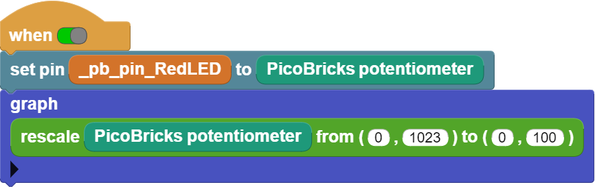

###########
Graphic Monitor
###########

Introduction
-------------
In this project, we will prepare a project in which we increase or decrease the brightness of the red LED with a potentiometer. In addition, we will simultaneously monitor the electrical change occurring during this process on the Microblocks graphic monitor. When the picobricks starts, the potentiometer value will be read continuously and the brightness value of the LED will be adjusted. Applications in which the effect of the electrical signal is reduced by changing the frequency is called ``PWM``. We will send the analog values we read from the potentiometer as PWM signals to the red LED and we will be able to adjust the illumination intensity.   

Project Details and Algorithm
------------------------------
When we look at the electronic items around us, you realize that they have many replaceable features and they are designed by engineers to be most useful to the user. Such as lighting systems, cooking systems, sound systems, cleaning systems. The way it works, the amount, the method, etc., by many system users. features can be programmed to change. In robotic projects, in the processes of changing the sound level, changing the motor speed, changing the brightness of the light, the electrical voltage is sent in a way that creates a lower or higher effect. By decreasing the frequency of the electrical signal to the component, it can be operated at a lower level, and by increasing the frequency of the outgoing electrical signals, it can be operated at a higher level. In systems without a screen, real-time graphic monitors are used to monitor some sensors and variables involved in the operation of the system. Graphic monitors make it very easy to detect the fault.

Wiring Diagram
--------------

.. figure:: ../_static/graphic-monitor.png      
    :align: center
    :width: 500
    :figclass: align-center
    
.. figure:: ../_static/graphic-monitor1.png      
    :align: center
    :width: 520
    :figclass: align-center

You can program and run Picobricks modules without any wiring. If you are going to use the modules by separating them from the board, then you should make the module connections with the Grove cables provided.

MicroPython Code of the Project
--------------------------------
.. code-block::

   from machine import Pin,ADC,PWM
   from utime import sleep
   #define libraries

   led=PWM(Pin(7))
   pot=ADC(Pin(26,Pin.IN))
   #define the value we get from the led and pot.
   led.freq(1000)

   while True:#while loop
    
    led.duty_u16(int((pot.read_u16())))
    print(str(int((pot.read_u16()))))
    #Turn on the LED according to the value from the potentiometer.
    
    sleep(0.1)#delay
                 

.. tip::
  If you rename your code file to main.py, your code will run after every boot.
   
Arduino C Code of the Project
-------------------------------

.. code-block::

   void setup() {
   // put your setup code here, to run once:
   pinMode (7,OUTPUT);//initialize digital pin 7 as an output
   pinMode (26,INPUT);//initialize digital pin 26 as an input
   Serial.begin(9600);//start serial communication

      }

   void loop() {
   // put your main code here, to run repeatedly:
   int pot_val = analogRead(26);
   int led_val = map(pot_val, 0, 1023, 0, 255);
   analogWrite(7, led_val);
   Serial.println(led_val);
   //turn on the LED according to the value from the potentiometer
  
   delay(100);//wait

   }

Coding the Project with MicroBlocks
------------------------------------

+------------------+
||graphic-monitor2||     
+------------------+

.. note::
  To code with MicroBlocks, simply drag and drop the image above to the MicroBlocks Run tab.
  

    
