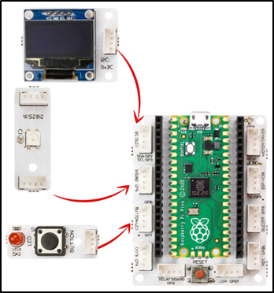
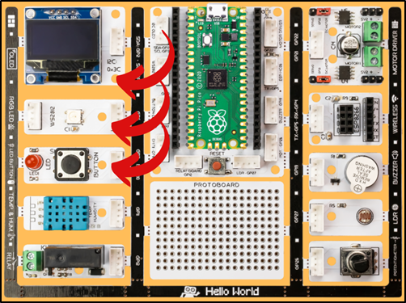
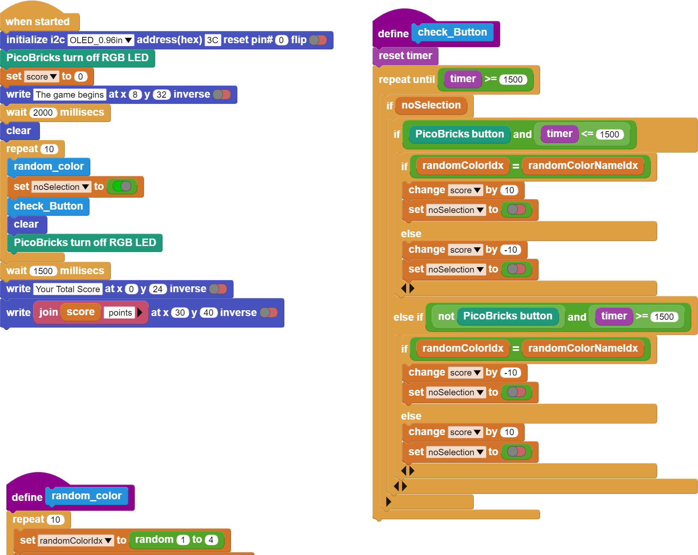

###########
Know Your Color
###########

Introduction
-------------
In this project you will learn about the randomness used in every programming language. We will prepare a enjoyable game with the RGB LED, OLED screen and button module of Picobricks. The game we will build in the project will be built on the user knowing the colors correctly or incorrectly.

Project Details and Algorithm
------------------------------

LEDs are often used on electronic systems. Each button can have small LEDs next to each option. By making a single LED light up in different colors, it is possible to do the work of more than one LED with a single LED. LEDs working in this type are called RGB LEDs. It takes its name from the initials of the color names Red, Green, Blue. Another advantage of this LED is that it can light up in mixtures of 3 primary colors. Purple, turquoise, orange…

One of the colors red, green, blue and white will light up randomly on the RGB LED on Picobricks, and the name of one of these four colors will be written randomly on the OLED screen at the same time. The user must press the button of Picobricks within 1.5 seconds to use the right of reply. The game will be repeated 10 times, each repetition will get 10 points if the user presses the button when the colors match, or if the user does not press the button when they do not match. If the user presses the button even though the colors do not match, he will lose 10 points. After ten repetitions, the user’s score will be displayed on the OLED screen. If the user wishes, he may not use his right of reply by not pressing the button.

Wiring Diagram
--------------

    

You can program and run Picobricks modules without any wiring. If you are going to use the modules by separating them from the board, then you should make the module connections with the Grove cables provided.

MicroPython Code of the Project
--------------------------------
.. code-block::

    from machine import Pin, I2C
    from picobricks import SSD1306_I2C
    import utime
    import urandom
    import _thread
    from picobricks import WS2812

    WIDTH  = 128                                            
    HEIGHT = 64                                          
    sda=machine.Pin(4)
    scl=machine.Pin(5)
    i2c=machine.I2C(0,sda=sda, scl=scl, freq=1000000)
    ws = WS2812(pin_num=6, num_leds=1, brightness=0.3)

    oled = SSD1306_I2C(WIDTH, HEIGHT, i2c)

    button = Pin(10,Pin.IN,Pin.PULL_DOWN)
    RED = (255, 0, 0)
    GREEN = (0, 255, 0)
    BLUE = (0, 0, 255)
    WHITE = (255, 255, 255)
    BLACK = (0, 0, 0)

    oled.fill(0)
    oled.show()

    ws.pixels_fill(BLACK)
    ws.pixels_show()

    global button_pressed
    score=0
    button_pressed = False

    def random_rgb():
    global ledcolor
    ledcolor=int(urandom.uniform(1,4))
    if ledcolor == 1:
        ws.pixels_fill(RED)
        ws.pixels_show()
    elif ledcolor == 2:
        ws.pixels_fill(GREEN)
        ws.pixels_show()
    elif ledcolor == 3:
        ws.pixels_fill(BLUE)
        ws.pixels_show()
    elif ledcolor == 4:
        ws.pixels_fill(WHİTE)
        ws.pixels_show()

    def random_text():
    global oledtext
    oledtext=int(urandom.uniform(1,4))
    if oledtext == 1:
        oled.fill(0)
        oled.show()
        oled.text("RED",45,32)
        oled.show()
    elif oledtext == 2:
        oled.fill(0)
        oled.show()
        oled.text("GREEN",45,32)
        oled.show()
    elif oledtext == 3:
        oled.fill(0)
        oled.show()
        oled.text("BLUE",45,32)
        oled.show()
    elif oledtext == 4:
        oled.fill(0)
        oled.show()
        oled.text("WHITE",45,32)
        oled.show()

    def button_reader_thread():
    while True:
        global button_pressed
        if button_pressed == False:
            if button.value() == 1:
                button_pressed = True
                global score
                global oledtext
                global ledcolor
                if ledcolor == oledtext:
                    score += 10
                else:
                    score -= 10
        utime.sleep(0.01)

    _thread.start_new_thread(button_reader_thread, ())

    oled.text("The Game Begins",0,10)
    oled.show()
    utime.sleep(2)

    for i in range(10):
    random_text()
    random_rgb()
    button_pressed=False
    utime.sleep(1.5)
    oled.fill(0)
    oled.show()
    ws.pixels_fill(BLACK)
    ws.pixels_show()
    utime.sleep(1.5)
    oled.fill(0)
    oled.show()
    oled.text("Your total score:",0,20)
    oled.text(str(score), 30,40)
    oled.show()
            

.. tip::
  Ifyou rename your code file to main.py, your code will run after every boot.
   
Arduino C Code of the Project
-------------------------------

.. code-block::

    #include <Adafruit_NeoPixel.h>
    #define PIN        6 
    #define NUMPIXELS 1
    Adafruit_NeoPixel pixels(NUMPIXELS, PIN, NEO_GRB + NEO_KHZ800);
    #define DELAYVAL 500
    #include <Wire.h>
    #include "ACROBOTIC_SSD1306.h" //define libraries
    int OLED_color;
    int RGB_color;
    int score = 0;
    int button = 0;

    void setup() {
    // put your setup code here, to run once:
    Wire.begin();  
    oled.init();                      
    oled.clearDisplay(); 

    pixels.begin();
    pixels.clear(); 
    randomSeed(analogRead(27));

        }

    void loop() {
    // put your main code here, to run repeatedly:
    oled.clearDisplay();
    oled.setTextXY(3,1);              
    oled.putString("The game begins");
    pixels.setPixelColor(0, pixels.Color(0, 0, 0));
    pixels.show();
    delay(2000);
    oled.clearDisplay();
  
    for (int i=0;i<10;i++){
    button = digitalRead(10);
    random_color();
    pixels.show();
    unsigned long start_time = millis();
    while (button == 0) {
        button = digitalRead(10);
        if (millis() - start_time > 2000)
          break;
    }
    if (button == 1){
  
        if(OLED_color==RGB_color){
          score=score+10;
        }
        if(OLED_color!=RGB_color){
          score=score-10;
        }
        delay(200);
    }
    oled.clearDisplay();
    pixels.setPixelColor(0, pixels.Color(0, 0, 0));
    pixels.show();
        }

    String string_scrore=String(score);
    oled.clearDisplay();
    oled.setTextXY(2,5);              
    oled.putString("Score: ");
    oled.setTextXY(4,7);              
    oled.putString(string_scrore);
    oled.setTextXY(6,5);              
    oled.putString("points");
    // print final score on OLED screen
  
    delay(10000);
        }

    void random_color(){

    OLED_color = random(1,5);
    RGB_color = random(1,5); 
    // generate numbers between 1 and 5 randomly and print them on the screen
    if (OLED_color == 1){
      oled.setTextXY(3,7);              
      oled.putString("red");
        }
    if (OLED_color == 2){
      oled.setTextXY(3,6);              
      oled.putString("green");
        }
    if (OLED_color == 3){
      oled.setTextXY(3,6);              
      oled.putString("blue");
        }
    if (OLED_color == 4){
      oled.setTextXY(3,6);              
      oled.putString("white");
        } 
    if (RGB_color == 1){
      pixels.setPixelColor(0, pixels.Color(255, 0, 0));
        }
    if (RGB_color == 2){
      pixels.setPixelColor(0, pixels.Color(0, 255, 0));
        }
    if (RGB_color == 3){
      pixels.setPixelColor(0, pixels.Color(0, 0, 255));
        }
    if (RGB_color == 4){
      pixels.setPixelColor(0, pixels.Color(255, 255, 255));
    }

    }

Coding the Project with MicroBlocks
------------------------------------
+------------------+
||know-your-color2||     
+------------------+

.. note::
  To code with MicroBlocks, simply drag and drop the image above to the MicroBlocks Run tab.
  

    
