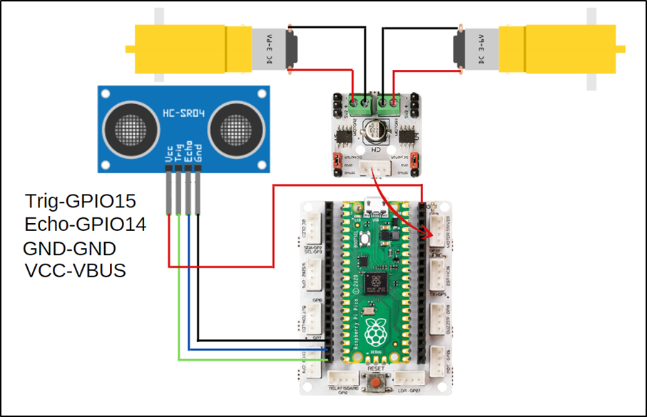

###########
Maze Solver Robot
###########

Introduction
-------------
In the maze solving robot project, we will use the 2WD robot car kit that comes out of the set.

Project Details and Algorithm
------------------------------

Coding education is as old as the history of programming languages. Today, different products are used to popularize coding education and make it exciting and fun. The first of these is educational robots. Preparing and coding robots improves children’s ``engineering`` and ``coding`` skills. Robotics competitions are organized by institutions and organizations to popularize coding education and encourage teachers and students. One of these competitions is the Maze Solver Robot competitions. These robots firstly learn the destination by wandering around the maze and return to the starting point. Then, when they start the labyrinth again, they try to reach their destination in the shortest way possible. Robots use distance sensors while learning about the maze. Infrared or ultrasonic sensors are used in these robots. Smart robot vacuums used in homes and workplaces also work with logic close to the algorithms of maze-solver robots. Thanks to their algorithms that constantly check and map the obstacles, they try to do it completely and without crashing. Most of the smart vacuums are equipped with LIDAR and infrared sensors, which make high-precision laser measurements for distance measurement and obstacle detection. In this project, we will make a simple robot with PicoBricks that you can prepare for maze solver robot competitions.

We will use the ``HC-SR04 ultrasonic distance sensor`` so that the robot can detect the distance in front of it and decide its movements on its own. In the maze, the robot will detect the distance in front of the car and move forward if it is empty. If the distance is less than 5 cm, the car will turn right, measure the distance again, if the distance on the right is greater than 5 cm, it will continue on its way, if it is less, it will turn left and move forward. In this way, by turning right and left, we will enable the vehicle to move forward and exit the maze through the empty roads in the maze.

Wiring Diagram
--------------

    

You can program and run Picobricks modules without any wiring. If you are going to use the modules by separating them from the board, then you should make the module connections with the Grove cables provided.

MicroPython Code of the Project
--------------------------------
.. code-block::

    from machine import Pin
    from utime import sleep
    import utime
    #define libraries

    trigger = Pin(15, Pin.OUT)
    echo = Pin(14, Pin.IN)
    #define sensor pins

    m1 = Pin(21, Pin.OUT)
    m2 = Pin(22, Pin.OUT)
    #define dc motor pins

    m1.low()
    m2.low()
    signaloff = 0
    signalon = 0

    def getDistance():
    trigger.low()
    utime.sleep_us(2)
    trigger.high()
    utime.sleep_us(5)
    trigger.low()
    while echo.value() == 0:
       signaloff = utime.ticks_us()
    while echo.value() == 1:
       signalon = utime.ticks_us()
    timepassed = signalon - signaloff
    distance = (timepassed * 0.0343) / 2
    return distance
    #calculate distance

    measure=0
    while True:
    
    measure=int(getDistance())
    print(measure)
    if measure>5:
        m1.high()
        m2.high()
        sleep(1) #if the distance is higher than 5, the wheels go straight
    else:
        m1.low()
        m2.low()
        sleep(0.5)
        m1.high()
        m2.low()
        sleep(0.5)
        measure=int(getDistance())
        if measure<5:
            m1.low()
        m2.low()
        sleep(0.5)
        m1.low()
        m2.high()
        sleep(0.5)
        #If the distance is less than 5, wait, move in any direction; if the distance is less than 5, move in the opposite direction

.. tip::
  If you rename your code file to main.py, your code will run after every boot.
   
Arduino C Code of the Project
-------------------------------

.. code-block::

    #include <NewPing.h>

    #define TRIGGER_PIN  15
    #define ECHO_PIN     14
    #define MAX_DISTANCE 400
    //define sensor pins

    NewPing sonar(TRIGGER_PIN, ECHO_PIN, MAX_DISTANCE);

    void setup() {
    pinMode(21,OUTPUT);
    pinMode(22,OUTPUT); //define dc motor pins
        }

    void loop() {
  
    delay(50);
    int distance=sonar.ping_cm();
    Forward();

    if(distance<5){

    Stop();
    delay(1000);
    Turn_Right();
    delay(1000);
    int distance=sonar.ping_cm();

    if(distance<5){
      Stop();
      delay(1000);
      Turn_Left();
      delay(500);
      // If the distance is less than 5, wait, turn right; if the distance is less than 5 again, move in the opposite direction
            }
        }
    }

    void Forward(){
    digitalWrite(21,HIGH);
    digitalWrite(22,HIGH); //if the distance is higher than 5, go straight
    }
    void Turn_Left(){
    digitalWrite(21,LOW);
    digitalWrite(22,HIGH); //turn left
    }
    void Turn_Right(){
    digitalWrite(21,HIGH);
    digitalWrite(22,LOW);  //turn right
    }
    void Stop(){
    digitalWrite(21,LOW);
    digitalWrite(22,LOW); //wait
    }
   
    
Coding the Project with MicroBlocks
------------------------------------
+--------------------+
||maze-solver-robot1||     
+--------------------+

.. |maze-solver-robot1| image:: _static/maze-solver-robot1.png

.. note::
  To code with MicroBlocks, simply drag and drop the image above to the MicroBlocks Run tab.
  

    
