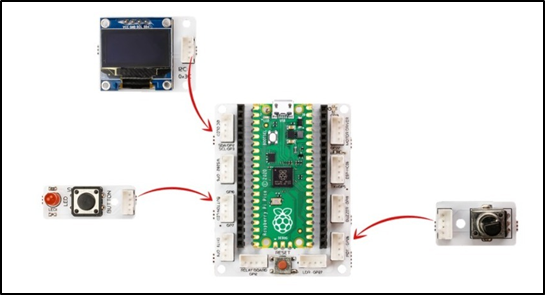

###########
My Timer
###########

Introduction
-------------
In this project, you will make your own time measuring device using Picobricks, OLED display, button and potentiometer modules. A Timer…

Project Details and Algorithm
------------------------------

Measuring time is a simple but important task that we do in our daily lives without realizing it. A surgeon in surgery, a business person trying to catch up with a meeting, an athlete trying to win, a student trying to finish an exam or a chess match… Smart wrist watches, phones and even professional chronometers are used to measure time. Time is a variable that should be used very accurately in electronic systems. For example, a washing machine; how long the drum will rotate clockwise, how much counterclockwise, how many seconds water must flow in order to dissolve the detergent are tasks done by measuring time. To develop projects where time is of the essence, you need to know how to use it.

When Picobricks starts, let’s put a statement on the screen that introduces the project and contains instructions. As the user turns the potentiometer, it will set a time in the range of ``0-60 minutes``. When the user presses the button of Picobricks after deciding the time with the potentiometer, it will start counting down in minutes and seconds on the screen. If the button is pressed while the time is running backwards, the Timer will stop and show the remaining time on the screen. If the minute, second and second value reaches zero without pressing the button, a notification stating that the time has expired will be displayed on the screen and the program will be stopped.

Wiring Diagram
--------------

    
.. figure:: ../_static/my-timer1.png      
    :align: center
    :width: 520
    :figclass: align-center

You can program and run Picobricks modules without any wiring. If you are going to use the modules by separating them from the board, then you should make the module connections with the Grove cables provided.

MicroPython Code of the Project
--------------------------------
.. code-block::

   from machine import Pin, I2C, ADC, Timer #to acces the hardware picobricks
   from picobricks import SSD1306_I2C #oled library
   import utime #time library

   WIDTH  = 128                                            
   WEIGHT = 64
   #define the width and height values

   sda=machine.Pin(4)
   scl=machine.Pin(5)
   #we define sda and scl pins for inter-path communication
   i2c=machine.I2C(0,sda=sda, scl=scl, freq=1000000)#determine the frequency values

   oled = SSD1306_I2C(128, 64, i2c)
   pot = ADC(Pin(26))
   button = Pin(10,Pin.IN,Pin.PULL_DOWN)
   #determine our input and output pins

   oled.fill(0)
   oled.show()
   #Show on OLED

   time=Timer()
   time2=Timer()
   time3=Timer()
   #define timers

   def minute(timer):
    global setTimer
    setTimer -=1
    
   def second(timer):
    global sec
    sec-=1
    if sec==-1:
        sec=59
        
   def msecond(timer):
    global msec
    msec-=1
    if msec==-1:
        msec=99
   #We determine the increments of the minute-second and millisecond values.
   sec=59
   msec=99

   global setTimer

   while button.value()==0:
    setTimer=int((pot.read_u16()*60)/65536)+1
    oled.text("Set timer:" + str(setTimer) + " min",0,12)
    oled.show()
    utime.sleep(0.1)
    oled.fill(0)
    oled.show()
   #If the button is not pressed, the value determined by the potentiometer is printed on the OLED screen.
    
   setTimer-=1

   time.init(mode=Timer.PERIODIC,period=60000, callback=minute)
   time2.init(mode=Timer.PERIODIC,period=1000, callback=second)
   time3.init(mode=Timer.PERIODIC,period=10, callback=msecond)
   #We determine the periods of minutes, seconds and milliseconds.
   utime.sleep(0.2)#wait for 0.2 second

   while button.value()==0:
    oled.text("min:" + str(setTimer),50,10)
    oled.text("sec:" + str(sec),50,20)
    oled.text("ms:" + str(msec),50,30)
    oled.show()
    utime.sleep(0.008)
    oled.fill(0)
    oled.show()
    if(setTimer==0 and sec==0 and msec==99):
        utime.sleep(0.1)
        msec=0
        break;
    #When the button is pressed, it prints the min-sec-ms values ​​to the OLED screen in the determined x and y coordinates.
    
    oled.text(str(setTimer),60,10)
    oled.text(str(sec),60,20)
    oled.text(str(msec),60,30)
    oled.text("Time is Over!",10,48)
    oled.show()
    #Print the minutes, seconds, milliseconds and "Time is Over" values ​​to the X and Y coordinates determi
            

.. tip::
  If you rename your code file to main.py, your code will run after every boot.
   
Arduino C Code of the Project
-------------------------------

.. code-block::

  #include <Wire.h>
  #include "ACROBOTIC_SSD1306.h"

  int minute;
  int second = 59;
  int milisecond = 9;
  int setTimer;

  void setup() {
  // put your setup code here, to run once:
  pinMode(10,INPUT);
  pinMode(26,INPUT);

  Wire.begin();  
  oled.init();                      
  oled.clearDisplay(); 

    }

  void loop() {
  // put your main code here, to run repeatedly:
  oled.setTextXY(1,2);              
  oled.putString("<<My Timer>>");
  oled.setTextXY(3,1);              
  oled.putString("Please use the");
  oled.setTextXY(4,1);              
  oled.putString("Potantiometer");
  oled.setTextXY(5,0);              
  oled.putString("to set the Timer");
  delay(3000);
  oled.clearDisplay(); 
  
    while(!(digitalRead(10) == 1))
    {
    setTimer = (analogRead(26)*60)/1023;
    oled.setTextXY(3,1);              
    oled.putString("set to:");
    oled.setTextXY(3,8);              
    oled.putString(String(setTimer));
    oled.setTextXY(3,11);              
    oled.putString("min.");
    }
    oled.clearDisplay(); 
    oled.setTextXY(1,1);              
    oled.putString("The Countdown");
    oled.setTextXY(2,3);              
    oled.putString("has begin!");
    
    while(!(digitalRead(10) == 1))
        {
    milisecond = 9- (millis()%100)/10;
    second = 59-(millis()%60000)/1000;
    minute = (setTimer-1)-((millis()%360000)/60000);
    
    oled.setTextXY(5,3);              
    oled.putString(String(minute));
    oled.setTextXY(5,8);              
    oled.putString(String(second));
    oled.setTextXY(5,13);              
    oled.putString(String(milisecond));
    oled.setTextXY(5,6);              
    oled.putString(":");
    oled.setTextXY(5,11);              
    oled.putString(":");
        }
    oled.setTextXY(5,3);              
    oled.putString(String(minute));
    oled.setTextXY(5,8);              
    oled.putString(String(second));
    oled.setTextXY(5,13);              
    oled.putString(String(milisecond));
    oled.setTextXY(5,6);              
    oled.putString(":");
    oled.setTextXY(5,11);              
    oled.putString(":");
    delay(10000);

    if (minute==0 & second==0 & milisecond==0){

    oled.setTextXY(5,3);              
    oled.putString(String(minute));
    oled.setTextXY(5,8);              
    oled.putString(String(second));
    oled.setTextXY(5,13);              
    oled.putString(String(milisecond));
    oled.setTextXY(5,6);              
    oled.putString(":");
    oled.setTextXY(5,11);              
    oled.putString(":");  
    oled.putString("-finished-");
    oled.setTextXY(7,5); 
    delay(10000);
    }

        }

Coding the Project with MicroBlocks
------------------------------------
+-----------+
||my-timer2||     
+-----------+

.. |my-timer2| image:: _static/my-timer2.png

.. note::
  To code with MicroBlocks, simply drag and drop the image above to the MicroBlocks Run tab.
  

    
