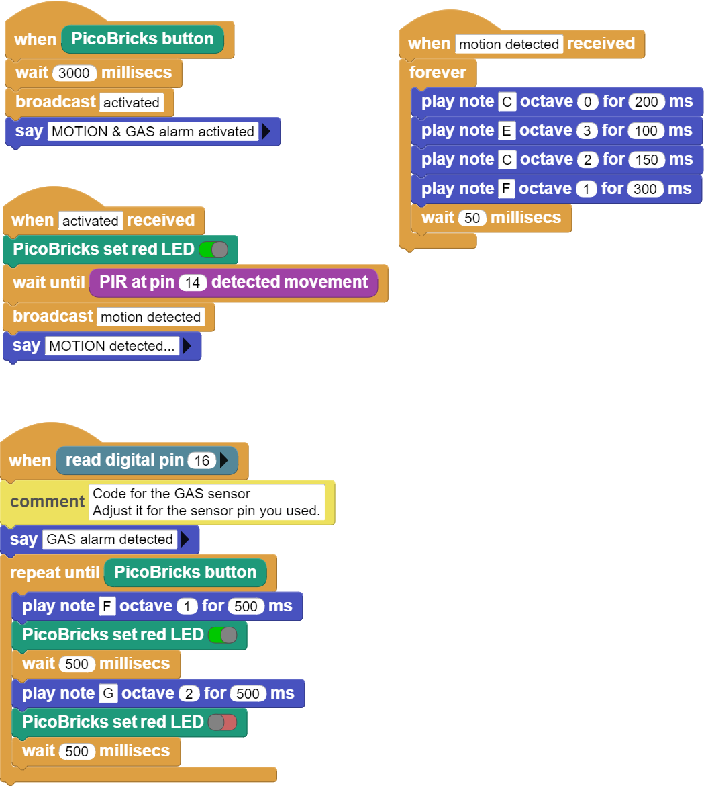

###########
Smart House
###########

Introduction
-------------
This sensor HC-SR501, also known as PIR sensor, detects motion by capturing the changes of infrared waves reflected by the human body.
When the HC-SR501 PIR sensor detects motion, it gives digital output for 3 seconds. We will use a Picoboard, buzzer and button LED module in the project.

Project Details and Algorithm
------------------------------

Workplaces, factories, homes and even animal shelters… There are different electronic systems that can be used to protect our living spaces against intruders. These systems are produced and marketed as home and workplace security systems. There are systems where the images produced by security cameras are processed and interpreted, as well as security systems that detect the human body and its movements with sensors and take action. Security systems are set up like a kind of alarm clock and give audible and visual warnings when an unidentified activity is detected in the specified time zone. It notifies the business or the home owner, and it can also make automatic notifications to the security units. Gas leakage, fire etc. in such cases, gas sensors are used in homes and workplaces to prevent poisoning. In a negative situation, people living in the environment are warned by giving a loud alarm. We will prepare a model smart home project with PicoBricks using the HC-SR501 and MQ-2 gas sensor. 

All parts must be in the model. When Picobricks starts, the button must be pressed to activate the alarm system. After pressing the button, we must wait 3 seconds for the hand to be pulled out of the model. At the end of 3 seconds, the red LED lights up and the alarm system is activated. When the alarm system detects a movement, the red LED will start to flash and the buzzer will sound the alarm. To mute it, Picobricks must be restarted.The MQ-2 sensor is always on. When it detects a toxic gas, it will notify you with a buzzer and red LED.

Wiring Diagram
--------------

.. figure:: ../_static/smart-house.png      
    :align: center
    :width: 400
    :figclass: align-center
    

You can program and run Picobricks modules without any wiring. If you are going to use the modules by separating them from the board, then you should make the module connections with the Grove cables provided.

MicroPython Code of the Project
--------------------------------
.. code-block::

    from machine import Pin, PWM
    from utime import sleep
    # define libraries
    PIR=Pin(14, Pin.IN)
    MQ2=Pin(1,Pin.IN)
    buzzer=PWM(Pin(20,Pin.OUT))
    redLed=Pin(7,Pin.OUT)
    button=Pin(10,Pin.IN,Pin.PULL_DOWN)
    # define output and input pins

    activated=0
    gas=0

    while True:
    if button.value()==1:
        activated=1
        gas=0 
        sleep(3)
        redLed.value(1)
        buzzer.duty_u16(0)
    if MQ2.value()==1:
        gas=1
    if activated==1:
        if PIR.value()==1:
            buzzer.duty_u16(6000)
            buzzer.freq(440)
            sleep(0.2)
            buzzer.freq(330)
            sleep(0.1)
            buzzer.freq(494)
            sleep(0.15)
            buzzer.freq(523)
            sleep(0.3)
    if gas==1:
        buzzer.duty_u16(6000)
        buzzer.freq(330)
        sleep(0.5)
        redLed.value(1)
        buzzer.freq(523)
        sleep(0.5)
        redLed.value(0)
        # LED will light and buzzer will sound when PIR detects motion or MQ2 detects toxic gas

.. tip::
  If you rename your code file to main.py, your code will run after every boot.
   
Arduino C Code of the Project
-------------------------------

.. code-block::

    void actived (){
    digitalWrite(7,1);
    while(!(digitalRead(14) == 1))
        {
    _loop();
        }
    motion_detected();
        }

    void motion_detected (){
    while(1) {
      // buzzer settings 
      tone(20,262,0.25*1000);
      delay(0.25*1000);
      tone(20,330,0.25*1000);
      delay(0.25*1000);
      tone(20,262,0.25*1000);
      delay(0.25*1000);
      tone(20,349,0.25*1000);
      delay(0.25*1000);
    // sound the buzzer when PIR detected a motion 
      _loop();
        }
        }

    void _delay(float seconds) {
    long endTime = millis() + seconds * 1000;
    while(millis() < endTime) _loop();
        }

    void _loop() {
        }

    void loop() {
    _loop();
        }

    void setup() {
  
    pinMode(10,INPUT);
    pinMode(1,INPUT);
    pinMode(20,OUTPUT);
    pinMode(7,OUTPUT);
    pinMode(14,INPUT);
    // define input and output pins
  
    while(1) {
      if(digitalRead(10) == 1){
          _delay(3);
          actived();
      }
      if(digitalRead(1) == 1){
          while(!(digitalRead(10) == 1))
          {
            _loop();
            tone(20,349,0.5*1000);
            delay(0.5*1000);
            digitalWrite(7,1);
            _delay(0.5);
            tone(20,392,0.5*1000);
            delay(0.5*1000);
            digitalWrite(7,0);
            _delay(0.5);
          }
      }
      _loop();
        }
        }

Coding the Project with MicroBlocks
------------------------------------
+--------------+
||smart-house1||     
+--------------+

.. note::
  To code with MicroBlocks, simply drag and drop the image above to the MicroBlocks Run tab.
  

    
