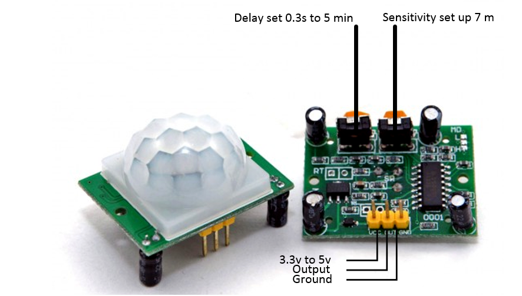

Troubleshooting
===========================

1. PIR sensor reacts too late
============================  
If your PIR sensor reacts too late or it does not react without touching it, you should adjust the sensitivity of your PIR sensor. To adjust the sensitivity of your PIR   sensor, the following steps can be taken to troubleshoot it and adjust it’s sensitivity.
  
- Wire the PIR sensor to the breadboard according to the circuit diagram below making sure that power supply Ground (GND) will connect to the negative (GND) pin of       the sensor and the supply positive(VIN) will connect to the positive (VCC) pin of the PIR sensor as shown below.

- Connect a resistor within the range of 0.1KΩ to 1KΩ from the OUT pin of the PIR sensor to the anode (positive) pin of an LED (any color) and connect the cathode    (negative) pin of the LED to Ground (GND). Note that the LED and the resistor can switch positions.

    

