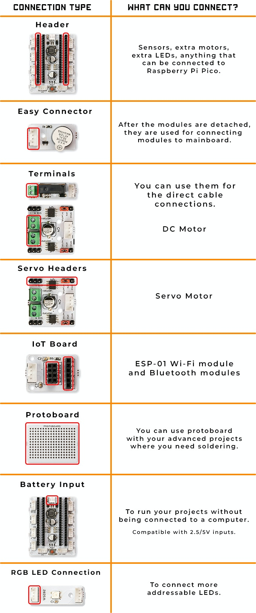

Connection Methods
====================

.. image:: /../_static/cable.gif

With Picobricks, you can build your circuits without cable clutter. Similarly, you can get rid of code confusion by coding with the Microbloks program. With this feature, we eliminate many problems that we may encounter when starting an ordinary robotic coding education lesson, thanks to the modular structure of the Picobricks. After entering the robotic coding training, we have the opportunity to do more projects by breaking the modules on the Picobricks from the necessary places and connecting the modules to the Raspberry Pi Pico with **Groove Cables.**

    
    
    
No soldering! There are unlimited connections.
--------------------------------------------------------

.. figure:: ../_static/cable2.jpg
    :align: center
    :width: 720
    :figclass: align-center
