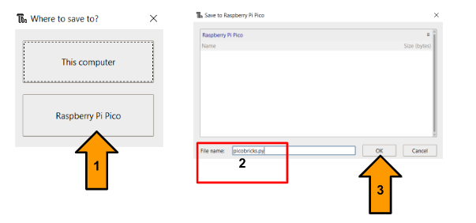
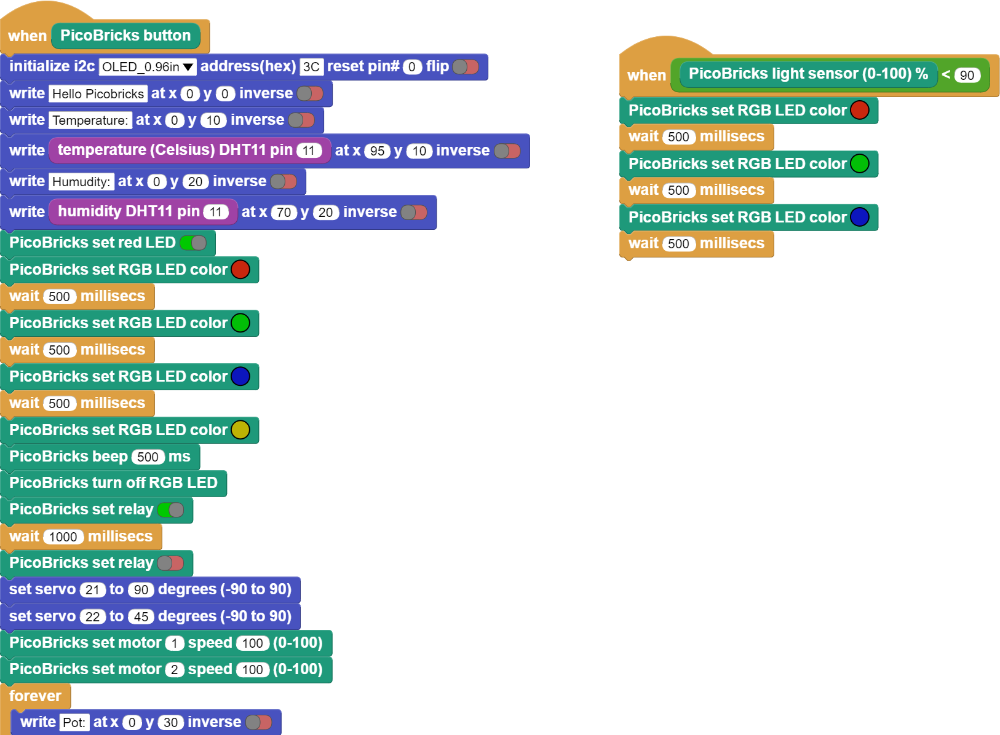

Frequently Asked Questions
===========================

How can I get PicoBricks to work when I split it?
--------------------------------------------------

We can use the 12 modules on the PicoBricks by separating them from the break points and plugging them into the right connectors on the PicoBricks main board with a groove cable.

.. figure:: ../_static/faq.png      
    :align: center
    :width: 620
    :figclass: align-center
    
    
Do I need to add the picobricks.py library when making a project with Thonny?
------------------------------------------------------------------------------

You can develop projects using different libraries, but you are required to use the picobricks.py library. In addition, the picobricks.py library is used in 25 projects included in the e-book.

To the picobricks.py library from the picobricks github page; 

You can reach it by following the steps `PicoBricks/Software/Pre-Installed Code/picobricks.py <https://github.com/Robotistan/PicoBricks/blob/main/Software/Pre-Installed%20Code/picobricks.py>`_

* How to add?

After downloading library, you need to load the picobricks.py library into the raspberry pi pico by pressing the ctrl+shift+s key combination as described in the picture below.

Should I BOOTSEL every time when I use PicoBricks?
---------------------------------------------------

You don't need to BOOTSEL every time, if you don't switch between coding platforms, you don't need to BOOTSEL when you reconnect picobricks to the coding platform you developed the last project on. However, if you switch to a different platform, you need to BOOTSEL your card.

How can I test Picobricks boards and modules?
----------------------------------------------

To test the modules on Picobricks, R&D team has created 2 different test codes using Thonny and Microblocks platforms. You can test by using these test codes.

`For Thonny <https://github.com/Robotistan/PicoBricks/blob/main/Software/Pre-Installed%20Code/test.py>`_;

.. tip::
  If you rename test.py to main.py, your code will run after every boot.

.. code-block:: bash

    from utime import sleep
    import time
    from machine import Pin, I2C, PWM, ADC
    from picobricks import SSD1306_I2C, WS2812, DHT11
    import framebuf
    import random

    WIDTH  = 128   # oled display width
    HEIGHT = 64    # oled display height

    def button_push(event):
        if button.value() == 1:
            oled.text("BUTTON : 1", 0, 10)
            oled.show()        
            motor_1.high()
            motor_2.high()
            time.sleep(0.5)
            motor_1.low()
            motor_2.low()
        
    i2c = I2C(0, scl=Pin(5), sda=Pin(4), freq=200000)   # Init I2C using pins (default I2C0 pins)
    oled = SSD1306_I2C(WIDTH, HEIGHT, i2c, addr=0x3c)   # Init oled display
    buzzer = PWM(Pin(20))
    buzzer.duty_u16(0)  
    relay = Pin(12, Pin.OUT)
    button = Pin(10, Pin.IN)
    motor_1 = Pin(21, Pin.OUT)
    motor_2 = Pin(22, Pin.OUT)
    pot = ADC(26)
    light_level = ADC(27)
    conversion_factor = 3.3 / (65535) 
    dht_sensor = DHT11(Pin(11))
    led = Pin(7, Pin.OUT)
    ws = WS2812(6, brightness=0.4)
    RED = (255, 0, 0)
    GREEN = (0, 255, 0)
    BLUE = (0, 0, 255)
    COLORS = (RED, GREEN, BLUE)

    for color in COLORS:
            ws.pixels_fill(color)
            ws.pixels_show()
            time.sleep(0.1)
    ws.pixels_fill((0,0,0))
    ws.pixels_show()

    buzzer.duty_u16(2000)
    buzzer.freq(831)
    time.sleep(0.5)
    buzzer.duty_u16(0)
    time.sleep(0.5)
    relay.high()
    time.sleep(0.5)
    relay.low()
    time.sleep(0.5)
    led.high()
    time.sleep(0.5)
    led.low()
    time.sleep(0.5)

    dht_read_time = time.time()
    button.irq(trigger=Pin.IRQ_RISING, handler=button_push)

    while True:
        if time.time() - dht_read_time >= 3:
            dht_read_time = time.time()
            try:
                dht_sensor.measure()
            except Exception as e:
                print("Warning: could not measure: " + str(e))

        oled.fill(0)
        oled.text("POT:      {0:.2f}V".format(pot.read_u16() * conversion_factor),0,20) # round(pot.read_u16() * conversion_factor, 2)
        oled.text("LIGHT:    {0:.2f}%".format((65535.0 - light_level.read_u16())/650.0),0,30)
        oled.text("TEMP:     {0:.2f}C".format(dht_sensor.temperature),0,40)
        oled.text("HUMIDITY: {0:.1f}%".format(dht_sensor.humidity),0,50)
        oled.show()
        time.sleep(1)
        oled.fill(0)

`For MicroBlocks <https://github.com/Robotistan/PicoBricks/tree/main/Software/Pre-Installed%20Code/Microblocks%20Test%20Code>`_;

    
    
.. tip::
 You can access the Microblocks test code by dragging the image to the Microblocks Run tab.
 

On how many different platforms can I code PicoBricks?
-------------------------------------------------------

PicoBricks, is a project development board that can be programmed on three different platforms with Microblocks, Thonny and Arduino IDE.

 .. figure:: ../_static/main.png      
    :align: center
    :width: 200
    :figclass: align-center
    
With MicroBlocks, we can develop projects by moving code blocks to our project page by drag-and-drop method. MicroBlocks is a block-based programming platform and is generally preferred by users with little coding knowledge, younger users or users who want to develop projects quickly.

Click `here <https://github.com/Robotistan/PicoBricks/tree/main/Software/Pre-Installed%20Code/Microblocks%20Test%20Code>`_; to go to MicroBlocks online editor.

 .. figure:: ../_static/main1.png      
    :align: center
    :width: 200
    :figclass: align-center
    

We can develop projects using the MicroPython language with the thonny coding platform. MicroPython is a programming language that eliminates punctuation (syntax) errors that are frequently made in coding platforms as much as possible.

 .. figure:: ../_static/main2.png      
    :align: center
    :width: 200
    :figclass: align-center

Arduino IDE platform is one of the most common programs used for physical programming. It allows us to develop projects using the C programming language.

How can I create a new discussion in the PicoBricks Community?
---------------------------------------------------------------

Click `here <https://community.robotistan.com/>`_; to reach the Picobricks Community page. After clicking the New Discussion tab, you can write the title and what you want to write and share it. For a more accurate assessment of your question, you can also choose a category before sharing.

How can I reach The PicoBricks projects?
-----------------------------------------

25 projects are presented to Picobricks users as ready by the Picobricks Team.

You can reach it by following the steps of `PicoBricks/Software/Examples/ <https://github.com/Robotistan/PicoBricks>`_; from Picobricks GitHub page.

You can also access these projects on Picobricks Website, Robotistan INC Youtube channel and PicoBricks e-book.
 
 
When I start splitting PicoBricks, do I have to split all the modules or can I only split one or a few modules?
----------------------------------------------------------------------------------------------------------------
 
You don’t need to split all modules to run Picobricks modules correctly. After splitting only one or a few modules, you can use the split modules by plugging them into the corresponding connector on the Raspberry Pi Pico module with grove cables.

What is the voltage range of the motor driver on the PicoBricks?
-----------------------------------------------------------------

The voltage range of the motor driver is 2.5-7.5V.
 
 

