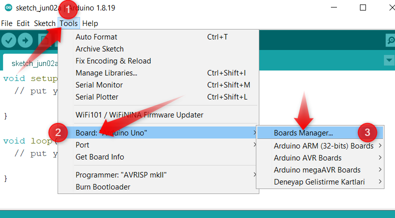
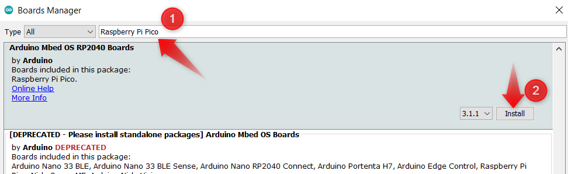

Arduino IDE
====================

Installation Arduino IDE
------------------------------------------

Picobricks offers us the opportunity to code with Arduino C. Getting started coding the Raspberry Pi Pico at the heart of Picobricks with the widely used Arduino IDE is pretty easy.

Download the Arduino IDE 1.8.x setup file from `Arduino Website <https://www.arduino.cc/en/software>`_ to your computer and install it.

First you need to add Raspberry Pi Pico to Arduino IDE. Start the Arduino IDE. Then go to ``Tools>Board>Boards Manager``.

Write ``“Raspberry Pi Pico”`` in field 1. After waiting for a while, click on the Arduino Mbed OS RP2040 Boards option and click the install button in field 2.

During all these installations, you must accept the approvals it will ask you for. When the installation is complete and click the close button, you will have added Pico to the Arduino IDE.

Writing and Running Code with Arduino IDE
------------------------------------------

When you want to code Pico with Arduino IDE, you just have to connect it to your computer by ``holding the BOOTSEL button for the first time.``

.. figure:: ../_static/arduino3.png
    :align: center
    :width: 720
    :figclass: align-center
    
    
    
In this way, Pico will be connected in bootloader mode and recognized by your computer as external memory. Connect Pico to your computer by holding down the Bootsel button. After seeing Pico as the computer's flash memory, activate your card by going to ``Tools>Board>Arduino Mbed OS RP2040 boards> Raspberry Pi Pico.``
     
.. figure:: ../_static/arduino4.png
    :align: center
    :width: 720
    :figclass: align-center

Write the code in the field number 1 below and follow the ``File>Save`` path and save it anywhere on your computer with the name ``"Blink".``

.. figure:: ../_static/arduino5.png
    :align: center
    :width: 720
    :figclass: align-center
    
After the saving process, we must click the ``"Upload"`` button in the 1st field to compile the code and save it in Pico. When we see Done uploading at the bottom, our code will run in Pico and the built-in LED will blink at 1-second intervals. Important Note: While coding Picobricks with Arduino IDE, connect it to your computer by pressing the BOOTSEL button at the first pass from Micropython or Microblocks firmware. You do not need to press BOOTSEL for subsequent code uploads. Enjoyable projects :)
    
.. figure:: ../_static/arduino6.png
    :align: center
    :width: 220
    :figclass: align-center

.. code-block:: bash

  void setup() {
  // put your setup code here, to run once:
  pinMode(7, OUTPUT); // initialize digital pin 7 as an output
    }
  void loop() {
    // put your main code here, to run repeatedly:
    digitalWrite(7, HIGH); //turn the LED on by making the voltage HIGH
    delay(500); //wait for a half second
    digitalWrite(7, LOW); //turn the LED on by making the voltage LOW
    delay(500); //wait for a half second
    }
